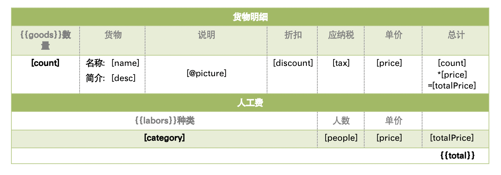

import Copyright from '@site/src/components/Copyright/OwnBlogByAuthor';

## 前言

[poi-tl](https://deepoove.com/poi-tl/)（poi template language）是
Word 模板引擎，使用模板和数据创建很棒的 Word 文档。

> 在文档的任何地方做任何事情（Do Anything Anywhere）是 poi-tl 的星辰大海。

<!-- more -->

## 通过表格插入图片列表，并按图片原始比例缩放图片

> 注意，当前方案针对的是 poi-tl-1.10.6 版本。

在表格中，可以通过 `@` 标签插入图片，如下图中的 `[@picture]`：



> 若循环变量的元素为 `PictureRenderData`，则需以 `[@#this]` 方式引入图片。

其最终由在 `com.deepoove.poi.config.Configure` 的构造函数中默认注册的插件
`com.deepoove.poi.policy.PictureRenderPolicy` 做数据渲染。

不过，`PictureRenderPolicy` 仅支持在
`com.deepoove.poi.data.PictureRenderData.getPictureStyle().getScalePattern()`
为 `WidthScalePattern.FIT` 时按所在单元格的宽度做图片的缩放，这通常会造成图片被拉伸，影响视觉效果。
而若是要保证图片在单元格内不被拉伸，则需要让其按照其原始比例进行缩放，
为此，需要重载 `PictureRenderPolicy`：

```java {13-15,39-48} title="PictureAutoFitRenderPolicy.java"
public class PictureAutoFitRenderPolicy extends PictureRenderPolicy {

  @Override
  public void doRender(RenderContext<PictureRenderData> context) throws Exception {
    renderPicture(context.getRun(), context.getData());
  }

  private static void renderPicture(XWPFRun run, PictureRenderData picture) throws Exception {
    // 与 com.deepoove.poi.policy.PictureRenderPolicy.Helper#renderPicture 的实现相同
    // ...

    if (!isSetSize(style)) {
      int[] size = getFittedSize(run, imageBytes);
      width = size[0];
      height = size[1];
    }

    // 与 com.deepoove.poi.policy.PictureRenderPolicy.Helper#renderPicture 的实现相同
    // ...
  }

  private static int[] getFittedSize(XWPFRun run, byte[] imageBytes) {
    BufferedImage original = BufferedImageUtils.readBufferedImage(imageBytes);
    int width = original.getWidth();
    int height = original.getHeight();

    double ratio = 1;
    BodyContainer bodyContainer = BodyContainerFactory.getBodyContainer(run);

    // 适配所在容器宽度
    int pageWidth = UnitUtils.twips2Pixel( //
      bodyContainer.elementPageWidth((IBodyElement) run.getParent()) //
    );
    if (width > pageWidth) {
      ratio = pageWidth / (double) width;
    }

    // 适配表格高度
    if (bodyContainer instanceof CellBodyContainer) {
      int pageHeight = UnitUtils.twips2Pixel( //
        ((XWPFTableCell) bodyContainer.getTarget()) //
          .getTableRow().getHeight() //
      );

      if (height > pageHeight) {
        ratio = Math.min(ratio, pageHeight / (double) height);
      }
    }

    width = (int) (width * ratio);
    height = (int) (height * ratio);

    return new int[] { width, height };
  }

  private static boolean isSetSize(PictureStyle style) {
    return (style.getWidth() != 0 || style.getHeight() != 0) //
            && style.getScalePattern() == WidthScalePattern.NONE;
  }
}
```

并重新注册 `@` 标签的渲染插件：

```java {3}
Configure conf = Configure.builder().build();

conf.plugin(GramerSymbol.IMAGE.getSymbol(), new PictureAutoFitRenderPolicy());
```

而在 `PictureAutoFitRenderPolicy` 中最核心的处理逻辑为：

```java
    // 适配表格高度
    if (bodyContainer instanceof CellBodyContainer) {
      int pageHeight = UnitUtils.twips2Pixel( //
        ((XWPFTableCell) bodyContainer.getTarget()) //
          .getTableRow().getHeight() //
      );

      if (height > pageHeight) {
        ratio = Math.min(ratio, pageHeight / (double) height);
      }
    }
```

也就是，当图片在表格单元格内时，获取其单元格所在行的高度，再计算其高度缩放比例，
并从宽度的缩放比中选择最小值最为最终的宽高缩放比，从而实现图像缩放后的宽高比与原图的宽高比相同，
确保图像不会被拉伸。

## 修复在文本框中渲染的 HTML 行距无故放大的问题

> 注意，当前方案针对的是 poi-tl-1.10.6 + poi-tl-ext-0.4.15 版本，。

在文本框（TextBox）中使用 [poi-tl-ext](https://github.com/draco1023/poi-tl-ext)
做 HTML 渲染时，可能会出现行距被强制加大了，并且无法通过设置行距的方式使其恢复正常效果。

> 之所以在文本框内渲染 HTML，是为了便于控制文本的高度，以避免内容超出预期范围而造成内容分页等问题。

而且，该问题的出现还具有一定的不确定性，但经过实测发现，出现该问题时，都是因为渲染后的
HTML 段落被默认启用了 **Snap to grid when document grid is defined**，而且无法在模板内取消。

故而，只能通过代码强制取消该设置：

```java {15}
HtmlRenderPolicy htmlRenderPolicy = new HtmlRenderPolicy(globalFont, globalFontSize) {

  @Override
  protected void afterRender(RenderContext<String> context) {
    super.afterRender(context);

    IBody container = context.getContainer();
    List<IBodyElement> bodyElements = container.getBodyElements();
    bodyElements.forEach((element) -> {
      if (element instanceof XWPFParagraph) {
        CTPPr pPr = RenderUtils.getPPr(((XWPFParagraph) element).getCTP());

        CTOnOff off = CTOnOff.Factory.newInstance();
        off.setVal(STOnOff.Enum.forString("0"));
        pPr.setSnapToGrid(off);
      }
    });
  }
};

Configure conf = Configure.builder()
                          .bind("html", htmlRenderPolicy);
                          .build();
```

也就是，在按照默认逻辑完成 HTML 的渲染后，再遍历段落，并强制关闭 `SnapToGrid`。

## 参考资料

- [poi-tl 文档](https://deepoove.com/poi-tl/)

<Copyright
owner={{
    name: 'flytreeleft', email: 'flytreeleft@crazydan.org'
  }}
/>
