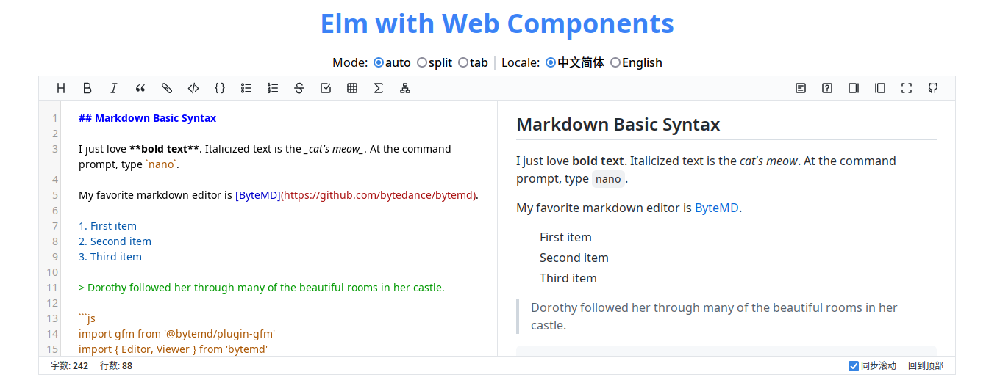

import Copyright from '@site/src/components/Copyright/OwnBlogByAuthor';
import Preface from './elm-tour/_preface.md';
import ReadMore from './elm-tour/_read_more.md';

## 写在开始

<Preface />

## 场景描述

<!-- more -->

## 工程搭建

## 方案实现

## 实践总结

## 扩展阅读

- [Interacting with Web Components](https://elmprogramming.com/interacting-with-web-components.html):
  以截图组件 `@github/image-crop-element` 为例，讲解 Elm 与 Web Components 集成的流程，
  同时提出以组件事件监听方式实时获取组件更新状态的方案
- [A Guide to Using Elm With Webcomponents](https://github.com/elm-community/js-integration-examples/blob/master/more/webcomponents/README.md):
  Elm 社区给出的与 Web Components 集成的开发指南
- [Lit](https://lit.dev/docs/):
  Web Components 开发框架，提供灵活且简便的开放方案，并支持 Shadow DOM 和内嵌到当前文档的两种实现方式
- [带你走进 Web Components 新世界](https://juejin.cn/post/7086682965371486216)
- [Material Components for Elm](https://github.com/aforemny/material-components-web-elm):
  基于 Web Components 实现的 Material 组件库。注意，需同时执行
  `yarn add material-components-web-elm`、`elm install aforemny/material-components-web-elm`
  - [在线演示](https://aforemny.github.io/material-components-web-elm/)

<ReadMore />

<Copyright
  owner={{
    name: 'flytreeleft', email: 'flytreeleft@crazydan.org'
  }}
/>
