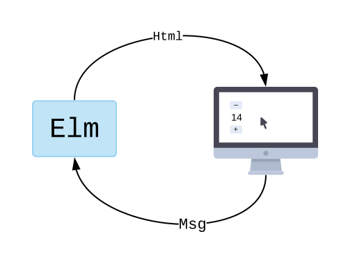

[《Elm 开发实践》](/blog/tags/elm-开发实践)系列文章为
[Elm](https://elm-lang.org/) 工程实践经验分享，
主要目的是针对各类业务场景提供基于 Elm 的可行性方案，
以此让更多人能够认识到 Elm 的优势以及其适用场景，
为前端开发提供不同的问题解决思路。

个人认为，Elm 是一种更为优秀和彻底的前端解决方案，在逐渐跨过其使用门槛后，便会对其爱不释手。
其 [强类型系统](https://guide.elm-lang.org/types/custom_types.html)、
[模式匹配](https://guide.elm-lang.org/types/pattern_matching.html)、
[模型视图更新机制](https://guide.elm-lang.org/architecture/)
以及 [函数式编程](https://guide.elm-lang.org/#why-a-functional-language)
让应用开发过程更加流畅、思路更加清晰、代码结构也更加简洁明了，
而且，由于数据不可变特性，其还支持
[Time Travel](https://package.elm-lang.org/packages/savardd/elm-time-travel/2.0.0/)
并自带 [调试器](https://elm-lang.org/news/the-perfect-bug-report)，
在开发过程中只需要通过其调试器观察和分析数据的变化情况便可以快速定位逻辑错误的位置，
而不需要在一堆混乱的代码中理出头绪（数据可以在任意位置被更新所造成的麻烦真心让人痛苦不堪）。

我甚至开始希望，能够参考 Elm 的设计模式从底层开始重新设计 GUI
的开发语言（展示层与交互层应使用同一套开发语言，以降低各层之间的转换消耗和开发人员的心智负担），
而不是简单地对 JavaScript 进行缝缝补补，也不要照搬面向对象等设计模式的思想去设计新的 GUI 语言，
对于现有的 JS 生态，也仅需提供与其的 [互操作](https://guide.elm-lang.org/interop/) 支持，
而不需要提供对其的兼容性支持。

不过，从当下实用的角度出发，
我们也没有必要教条地按照理想的 Elm 模式（比如，消除 CSS、组件无状态等）进行开发，
完全可以在不破坏 Elm 核心原则（模型/视图单向更新、数据不可变、强类型系统、函数式编程等）的前提下，
结合 JS 的优势实现自己的开发需求。
