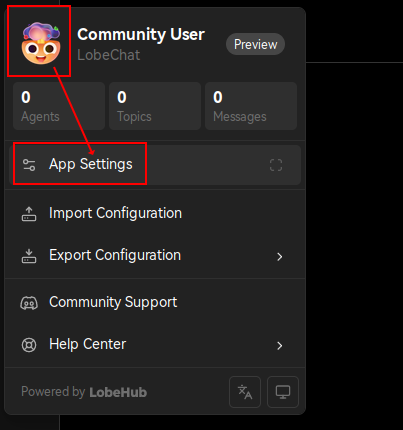
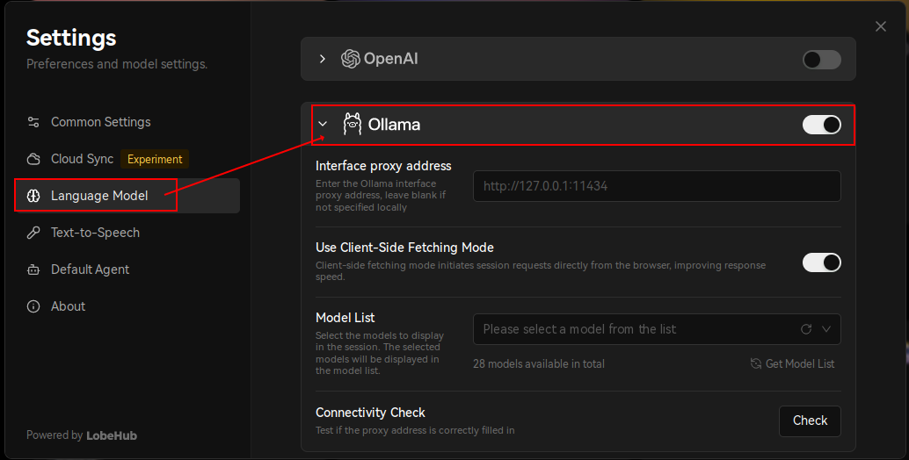
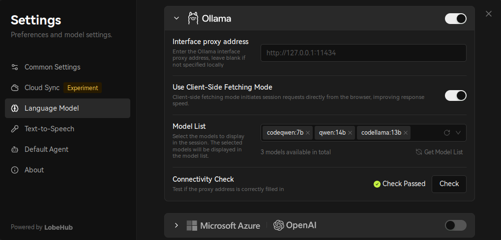
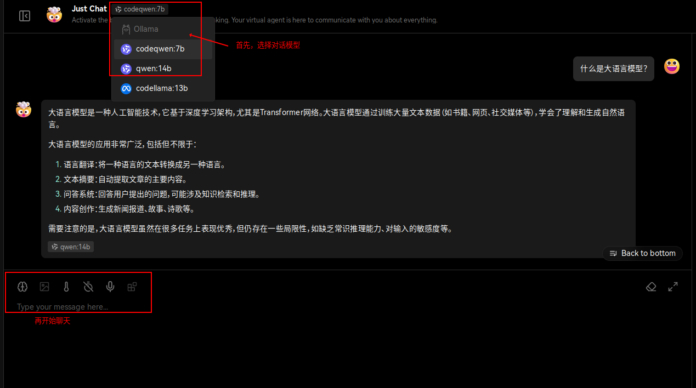
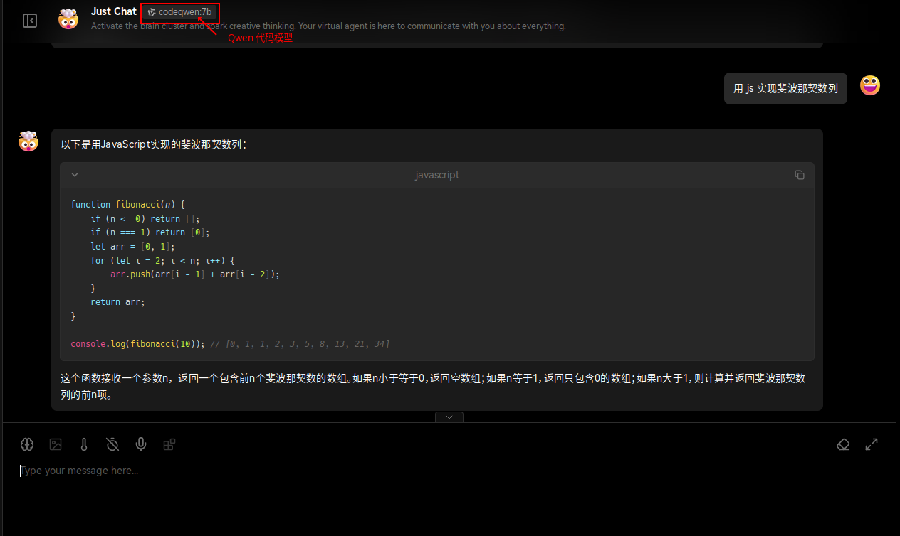

import Copyright from '@site/src/components/Copyright/OwnBlogByAuthor';

## 前言

商业化的大语言模型（LLM，Large Language Model）的运行需要消耗大量的 GPU 算力和能源，
对于个人或者中小企业而言，其投入成本是巨大的，并且就目前的 AI 适用场景来看，
巨量的投入并不能产生相应的回报，因此，对于数据保密性要求不高的企业来说，
直接使用商业化的服务和方案是最佳选择。

不过，借助于 [Ollama](https://ollama.com/) 我们还是可以在本地 CPU 上运行开源大模型，
以亲身体验当下前沿 AI 技术的能力。

> 也可以考虑将 Ollama 作为 LLM 的私有化部署方案，在 CPU 和 GPU 算力较大的情况下，
> 其运行速度还是可以接受的。

## 部署架构

```plantuml
database "大语言模型" as llm
control "Ollama" as engine
actor "用户" as user

llm -up(0)-> engine: 运算
user -left--> engine: 询问
engine -right--> user: 回复
```

大语言模型可以看做是一个由大量语料训练得到的、可直接使用的 LLM 数据库，
而 Ollama 则是一个针对 LLM 数据库的运行容器，由其提供推理运算能力，
负责对用户的提问做出合理的答复。

也就是，LLM 的运行算法是确定的，影响输出结果的关键点在于 LLM 数据库的完善度和准确性。
如果要定制出符合要求的 LLM 库，除了收集训练语料和参数调优以外，还需要大量的
GPU 算力进行较长时间的训练。

> 如果没有足够的算力，可以考虑租用按小时计费的 GPU 算力。

如果仅仅是尝鲜，或者没有行业的领域性需求，则可以直接使用开源的大语言模型，
可以省去大量算力和时间消耗。

## 部署指南

本例采用 Ollama Docker 镜像方式部署，并直接在 CPU 上运行，操作系统为 Linux。

运行环境要求如下：

- 内存: 7B 模型要求 8GB+，13B 模型要求 16GB+，33B 模型要求 32GB+
- 存储: 100 GB+

在本地准备好 Docker 或 Podman 容器运行环境后，执行以下命令启动 Ollama 容器：

```bash
# Note: /var/lib/ollama 为 LLM 模型数据的存放目录，可按需自由调整
mkdir -p /var/lib/ollama
docker run -d \
  --name ollama \
  -p 11434:11434 \
  -v /var/lib/ollama:/root/.ollama \
  ollama/ollama
```

然后，在 [Ollama 大语言模型库](https://ollama.com/library) 中选择并下载合适的
LLM 模型。不同的模型有不同的应用场景，比如，专用于聊天的、用于写代码的等等。
中文环境下，可以优先选择 [Qwen](https://ollama.com/library/qwen)：

```bash
# 进入 Ollama 容器。若要退出，则在容器内执行 exit 命令即可
docker exec -it ollama bash

# 在容器内执行命令以下载 LLM 模型
ollama pull qwen:14b

# 查看已下载的 LLM 模型
ollama list
```

待 LLM 模型下载完成后，便可以通过 API 接口向 Ollama 提问：

```bash
# 在容器外执行
curl http://localhost:11434/api/generate -d '{
  "model": "qwen:14b",
  "prompt":"什么是大语言模型？"
}'
```

> 其中，`model` 为 LLM 模型名称，`prompt` 为提示词。

以上问题将得到如下输出结果：

```json
{"model":"qwen:14b","created_at":"2024-05-15T03:56:13.983381882Z","response":"大","done":false}
{"model":"qwen:14b","created_at":"2024-05-15T03:56:14.641577823Z","response":"语言","done":false}
{"model":"qwen:14b","created_at":"2024-05-15T03:56:15.267275048Z","response":"模型","done":false}
{"model":"qwen:14b","created_at":"2024-05-15T03:56:15.901120594Z","response":"是一种","done":false}
{"model":"qwen:14b","created_at":"2024-05-15T03:56:16.542725011Z","response":"人工智能","done":false}
{"model":"qwen:14b","created_at":"2024-05-15T03:56:17.170318538Z","response":"技术","done":false}
{"model":"qwen:14b","created_at":"2024-05-15T03:56:17.796656774Z","response":"，","done":false}
{"model":"qwen:14b","created_at":"2024-05-15T03:56:18.449802319Z","response":"它","done":false}
{"model":"qwen:14b","created_at":"2024-05-15T03:56:19.121448976Z","response":"基于","done":false}
{"model":"qwen:14b","created_at":"2024-05-15T03:56:19.727120163Z","response":"深度","done":false}
{"model":"qwen:14b","created_at":"2024-05-15T03:56:20.340255622Z","response":"学习","done":false}
{"model":"qwen:14b","created_at":"2024-05-15T03:56:20.978352305Z","response":"算法","done":false}
{"model":"qwen:14b","created_at":"2024-05-15T03:56:21.591730329Z","response":"，","done":false}
...
```

接下来，可以为 Ollama 部署一个 WebUI，以便于以更友好的界面进行 AI 问答。

在本例中，我们使用 [LobeChat](https://lobehub.com/zh/docs/usage/providers/ollama)
作为 Ollama 的前端，并依然采用容器化部署：

```bash
# 启动 LobeChat 容器
# 环境变量设置: https://lobehub.com/zh/docs/self-hosting/environment-variables/basic
docker run -d \
  --name lobe-chat \
  -e OLLAMA_PROXY_URL=http://127.0.0.1:11434 \
  -e OLLAMA_MODEL_LIST=qwen:14b \
  -p 3210:3210 \
  lobehub/lobe-chat

# 重新创建 Ollama 容器，以支持接口跨域访问：数据已映射至本地磁盘，重建不会丢失数据
docker rm -f ollama
docker run -d \
  --name ollama \
  -e OLLAMA_ORIGINS="*" \
  -p 11434:11434 \
  -v /var/lib/ollama:/root/.ollama \
  ollama/ollama
```

在 LobeChat 启动完毕后（通过容器日志判断：`docker logs lobe-chat`），
通过浏览器访问本地地址 `http://localhost:3210`。

接着，打开 LobeChat 配置页面：



再启用 Ollama：



并在 `ModelList` 中选择已下载的 LLM 模型：



配置完成后，便可以开始聊天了（需要等待几分钟到数十分钟不等）：





## 参考资料

- [Ollama 官网](https://ollama.com/)
  - [Ollama 源码](https://github.com/ollama/ollama)
  - [Ollama 大语言模型库](https://ollama.com/library)
  - [Ollama 定制提示词](https://github.com/ollama/ollama?tab=readme-ov-file#customize-a-prompt):
    可根据提示词自动运行不同的 LLM 模型
- [Ollama：本地运行大型语言模型的轻量级框架](https://juejin.cn/post/7338742634167353356)
- [Awesome Chinese LLM](https://github.com/HqWu-HITCS/Awesome-Chinese-LLM):
  整理开源的中文大语言模型，以规模较小、可私有化部署、训练成本较低的模型为主，
  包括底座模型，垂直领域微调及应用，数据集与教程等
- [在本地跑一个大语言模型(2) - 给模型提供外部知识库](https://juejin.cn/post/7343513356396052532):
  基于 Ollama 的 RAG（检索增强生成，Retrieval Augmented Generation）定制支持
- [在本地跑一个大语言模型(3) - 让模型自主使用工具 ](https://juejin.cn/post/7343452738159083535):
  基于 Ollama 实现调用外部工具的能力


<Copyright
  owner={{
    name: 'flytreeleft', email: 'flytreeleft@crazydan.org'
  }}
/>
