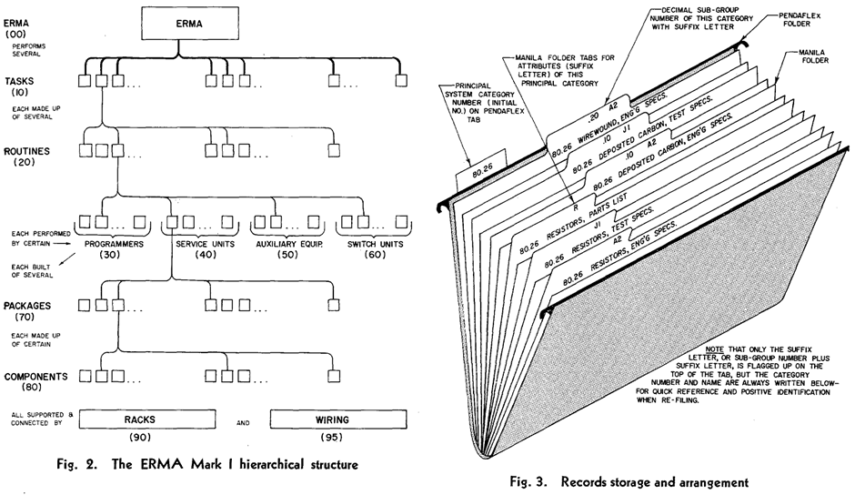
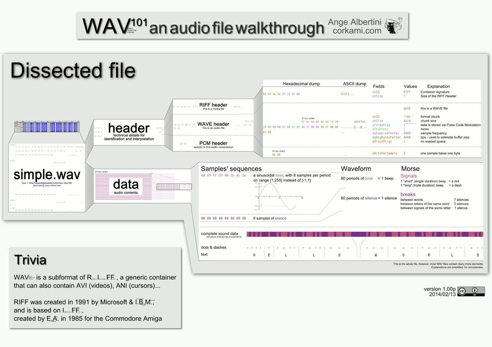

import Copyright, {Declaration} from '@site/src/components/Copyright/TranslationBlogByFlytreeleft';
import {Translation, Text} from '@site/src/components/Translation';


# Programmer's critique of missing structure of operating systems


<Declaration />

Some time ago, I've come across a [contemplation](https://www.cs.kent.ac.uk/people/staff/srk21/research/papers/kell13operating.pdf) on the topic of necessity of operating systems. I've been doing sort of "research" about this for almost two years, so I've decided to write up central thoughts along with links to some relevant sources of information on this topic.

## Be aware

This blog contains a wall of text.

I would like to declare that I am talking about myself. When I write that something is "_necessary_", "_possible_", or "_viable_", what I mean is that it's "_necessary for me_", "_possible for me_", or "_viable for me_".

I've seen too many discussion dramas caused by reading between lines and by applying reader's presuppositions and opinions on the topic of author's character. I know that this notice probably wouldn't help, but please, try to read and think about presented ideas with open mind.

If you find topics presented here controversial, nonsensical, downright outrageous or stupid - please, calm down. Remember the declaration presented in previous paragraphs. I am not talking about you, I don't have the need or urge to press something on you, break your workflow or slander your system. Take it as my strangeness, or maybe a possible direction of research. Please, don't apply it to yourself.

If you don't want to comment in discussion threads linked at the end of the article, you can send me an email to `bystrousak@kitakitsune.org` with some meaningful subject. I've written a lot of articles like this over the years and I still talk to people who read them to these days, even seven years after the publication. I value your opinion.

## Why?

In recent years, I've worked for several companies that make software. In some cases, I was a part of bigger teams, in other cases, I started with a few other programmers from scratch. I was often involved in designing the system's architecture, if I wasn't the one creating it from the beginning.

I work as a "_backend programmer_". My job description is to create systems which read, process and store all kinds of data, parse all kinds of formats, call all kinds of programs and interact with other systems and devices.

In the _Czech National Library_, I was a part of a three-man team where I was working on a system for processing electronic publications. I wrote almost the whole backend code, from data storage to communication with existing library systems; Aleph, Kramerius, or [LTP](https://en.wikipedia.org/wiki/Digital_preservation) (Long Time Preservation). For storage, we were using ext4/CentOS and object storage [ZODB](https://en.wikipedia.org/wiki/Zope_Object_Database) forced by [Plone](https://plone.org/) frontend. For the communication, the system used all kinds of protocols, from REST and upload of XML files to FTP, to zipping files with generated XML manifest and uploading them to smb. Backend microservices and frontend used RabbitMQ.

In another company, which shall not be named, I worked on a system for DDoS protection. I can't talk about specific details because of the NDA I've signed but you could get all kinds of buzzwords from the job ads from that time; Linux, Python, SQL and NoSQL databases, all kinds of existing open-source software and RabbitMQ for communication. Most of the communication backend was written by me.

I also worked on the backend for the _Nubium development_, a company which operates probably the biggest Czech file hosting website [uloz.to](uloz.to). I've refactored and partially designed pieces of software that handle the storage and redistribution of files across different servers, and also software that handles processing of used data. Icons with thumbnails that show in preview of compressed and video files is one example of the stuff I've done there, among a good deal of other stuff you can't see directly.

I also did websites and REST services for several other companies, and I've touched more exotic stuff as well. For example, I was a part of a three-man team working on a project of a video recognition system that detected objects in live video feeds from all kinds of public tunnels (Metro, road tunnels). There, I've learned a lot from the machine learning optimization tasks I was solving, from the low-level image processing and from the architecture of the whole backend code.

I'm telling you this not only to establish my credibility, but also because I've seen the same pattern everywhere I worked; independently created, but approximately similar piece of software, which has naturally grown from several requirements:

- Reliable storage of a large number of small files (millions or billions of files, from megabytes to gigabytes per file), or a smaller number of large files (terabytes per file).
- Reading and storage of configuration in some kind of structured format (INI, JSON, XML, YAML, ..).
- Structured communication between internal services, but also with external programs.
- Distributed architecture with multiple physical machines, which allows good scaling.

If you are a programmer, you probably know what I am getting to. If many programmers create the same pattern on top of some programming library, it is not a mistake of those people, but a mistake in the design of the library.

As I was thinking about it, I've realized that the architecture of the operating system itself is wrong for this kind of job. The stuff it offers, and the stuff it allows us to do, is not what we want and expect. Especially not from the "_programmer's user interface_" point of view, which is the stuff I often work with as a programmer.

## Operating system

When I was a kid, I thought I knew what an operating system is; _Windows_, that's for sure! That's the stuff everyone has on their computer; there is a button with "Start" on it in the left bottom corner, and if you start a computer and only a black screen comes on, you'll have to type `win` to make it appear.

High school taught me a definition, by which the operating system is "_equipment in the form of a program, which makes the input-output devices of the computer available_".

Later, I've found out that there are all kinds of operating systems, and almost all of them do the same stuff; they create ± united abstraction on top of the hardware, allow running different kinds of programs, offer more or less advanced filesystem and networking, and also handle memory and multitasking and user permissions.

Today, operating system is for most of the people that thing which they use to run browser where they watch _youtubes_ and _facebooks_ and also send messages to others. Sometimes, it can run games and work with all kinds of hardware, from CD-ROM to keyboard.

For advanced users, OS is a specific form of a database and API, which allows them to run programs and also provides standardized mechanism for different operations, such as, for example, printing a character on the screen, storing something under a name in the permanent storage, creating connection over the Internet, and so on.

We usually tend to think about the OS as about something that is given and more or less changeless, something that we pick from the Holy Trinity (Windows, Mac, Linux), around which crouches a range of small (0.03%) alternatives (*BSD, Plan9, BeOS,..).

For some reason, almost all used operating systems are, with a few exceptions, almost the same. I would like to explore whether that is really desired property or an artifact of historical development.

## Short history of operating systems

First computers didn't have operating systems and were generally everything but user friendly. The only way to program them was by directly changing hardware switches.

Then, computers programmed by punch cards and tape came. In order to use them, operators still had to [manually enter the bootloader](https://youtu.be/XV-7J5y1TQc?t=242) directly into the memory to tell the computer how to use the punch tape hardware. But the rest of the work was done by a key.

System worked on so-called "batches". A programmer delivered a medium with data and a program to work on this data, a system operator then loaded the given "batch" to the computer and run the program. When the program finished, he returned results or error message to the programmer.

Since the whole process required quite a lot of manual work, it was only natural that parts of the whole process were automated in form of tools and libraries with useful functions; for example, a loader which is loaded automatically when the computer starts and allows to load programmer's program only by pressing a specific button. Or _subroutines_ which print content of the memory in case of an error. This bundles of tools were called [monitors](https://en.wikipedia.org/wiki/Resident_monitor).

As computers at that time were really, really expensive, there was a pressure to share them amongst multiple users at the same time. This gave birth to the first _operating systems_ which merged functionality of the _monitors_ with support for running multiple programs at once together, and also added user management and concurrent user sessions.

Increasingly complex hardware and complexity of the direct control put pressure on the universality and reuse of the code across different machines and their versions. Operating systems began to support standard devices. It was no longer necessary to give specific address of memory on the disc drive, you could just store the data under some name, and later, also in the directory. First file systems were born. With the support of concurrent access of multiple users, it was also quite obvious that it is necessary to separate their processes and programs so that they can't read and overwrite each other's data. This gave rise to memory allocators, virtual memory and to multitasking as we know it.

Operating systems became a layer which stands between the user, who was no longer required to become a programmer, and the hardware. They provide standardized ways to store data, print out characters, handle keyboard input, printing on the printer and running batches or programs.

Later on, also graphical interface and networking was added. Personal computers offered plenty of devices, all of which had to be supported by the operating system. Except for a few exceptions, it was all iterative development which didn't bring anything new. Everything just got better and improved, but the paradigm itself didn't change.

## Criticism of the operating system

I have no problem with the concept of operating system as a hardware abstraction. On the contrary, I have a problem with the concept of OS as a user interface. And I don't mean graphical interface, but everything else you are interacting with, thus everything that has some kind of "shape";

### Concept of the file system

Think about what it really is; a limited hierarchical _key-value_ database.

It is limited because it not only limits the allowed subset and size of the _key_, which is in better cases stored as UTF, but also the _value_ itself. You can only store a stream of bytes. That seems reasonable only until you realize that it is a hierarchical (tree-based) database, which doesn't allow you to store structured data directly. The number of inodes (branches in the structure) is also limited to a number which is tens of thousands in the worst cases; however, it is several millions of items in one _directory_ at most.


In two of my previous jobs, we had to go around inode limitation by using stuff like [BalancedDiscStorage](http://balanceddiscstorage.readthedocs.io/) or storing the files into three subdirectories named by the first letters of the MD5 hash of the file.

Filesystem is so shitty database, that for most of the operations, atomicity is not supported and transactions are not supported at all. Parallel writes and reads work differently in different operating systems, if at all, and in fact, nothing is guaranteed at all. Compare it to the world of databases where the [ACID](https://en.wikipedia.org/wiki/ACID_(computer_science)) is considered a matter of course.

File system is specifically restricted database. Everyone I know who tried to use it for anything non-trivial, shot himself into the leg sooner or later. It doesn't matter whether it is a programmer who thinks that he'll just store that sequence into the files, or a basic user who can't get a sense in his own data and has to create elaborate schemes of storing personal files into the groups of directories and use specialized tools to search for stuff in order to find anything. Bleeding edge is when the filesystem can recognize that it has corrupted data and can recover them by using error-correcting algorithms, but only if you have discs in the RAID.

Don't get me wrong. I get that the point is somewhere else. You want to solve the low-level stuff, disc sectors, journaling, disk plates and partitions and RAIDs and everything is really great progress from how we stored data on the storage before. _But_ - from the point of the user interface - isn't this progress in the wrong direction?



Original filesystems were a metaphor used for storing _files_ into the _folders_. It was meant to be a mental tool, an idea given to people who were used to work with paper, so they could understand what they were doing. And among many technical limitations of the current day filesystem, this metaphor is restricting us even more because it restricts our _thinking_. I can't help but wonder whether we shouldn't drop the direction "_how can we improve this fifty-year-old metaphor_" (by using tags, for example) and focus on "is this really the best metaphor for storing data?" question instead.

### Programs

Purely physically, programs as such are nothing but sequences of stored bytes. Basically, there can be nothing else for the operating system, as the operating system's file-database does not know how to work with anything else.

Let me give you an overwhelmingly exaggerated explanation of how programs work.

Programs are at first written in a source code of a chosen programming language, which is then compiled and linked into one block of data. Then, it is punched on punch cards (binary data) and plugged into an appropriate box (file) in the correct section of a file cabinet.

When a user wants to run the program, he writes its name on the command line or clicks on the icon somewhere in the system. Stacked punch-cards are then taken from the box stored somewhere in the file cabinet and loaded into the memory. For a program, memory looks like one huge linear block, and thanks to the virtual memory, it seems like the program is the only thing running on the system. Binary code is then run from the first punched cards to the last, but it can conditionally jump and choose a different punched card by its address.


<figcaption>
  <em>(Structure of the PE executable file. Source:</em> <a href="https://github.com/corkami/pics/"><em>https://github.com/corkami/pics/</em></a><em>.)</em>
</figcaption>

Programs can also read parameters from the command line, use shared library, call API of the operating system, work with filesystem, send (numeric) signals to other programs, react to such signals, return (numeric) values or open sockets.

What's wrong with that?

I don't want to say that the concept itself is wrong. BUT. Again, it is the same old metaphor extended a few steps into the future by iterative progress. Everything is really, really _low-level_. The whole system has changed only minimally in the last 40 years and I can't get rid of the idea that rather than arriving at absolute perfection, we are stuck somewhere in a twist of local maximum.

[Lisp Machines](https://en.wikipedia.org/wiki/Lisp_machine), [Smalltalk](http://toastytech.com/guis/alto3.html) and [Self's environment](http://blog.rfox.eu/en/Series_about_Self/Environment_and_the_programming_language_Self_part.html) have taught me that it can be done differently. The programs do not necessarily have to be a collection of bytes, they can be small separate objects that are (by a metaphor of sending messages) callable from other parts of the system, and that dynamically compile as needed.

Are you familiar with a [Unix philosophy](https://en.wikipedia.org/wiki/Unix_philosophy) which says that you should compose solutions to your problems from small utilities; do one thing, focus on it, and do it well? Why don't we take the idea to the next level and make small programs from every function and method of our programs? This would allow them to communicate with the methods and functions of other programs in the same way as [microservices](https://en.wikipedia.org/wiki/Microservices) work.

It works in Smalltalk; it can be versioned, it can use and be part of the dependency specification system, handle exceptions, help, and who knows what else. Can't we do this with programs in general?

### Data without a structure, called Files

> The whole UNIX ethos has been a huge drag on industry progress. UNIX's pitch is essentially: how about a system of small functions each doing discrete individual things... but functions must all have the signature `char *function(const char *)`? Structured data is for fools, we'll just reductively do everything as text. What we had in 1972 is fine. Let's stick with that.

(Source: http://www.righto.com/2017/10/the-xerox-alto-smalltalk-and-rewriting.html?showComment=1508781022450#c7613952874348706529)

And here we are again, with the binary data. At first glance, it is a brilliant idea. Nothing can be more universal.

So, where is the problem?

Virtually all data has its own internal structure. Whenever programmers work with the data and don't just move them around, they have to parse them, that means to slice them and create trees of structures out of the data. Even streams of bytes, for example, [audio](https://en.wikipedia.org/wiki/WAV) or video data have their own structure of chunks to iterate over.



<figcaption>
  <em>(Structure of the WAV file. Source:</em> <a href="https://github.com/corkami/pics/"><em>https://github.com/corkami/pics/</em></a><em>.)</em>
</figcaption>

This happens over and over again. Each program takes _raw_ data, gives them structure, works with it and then throws it over in the act of collapsing the data back to the _raw_ binary data.

Current computer culture is obsessed with parsers and external descriptions of the data which could carry the structure itself, in the form of metadata. Every day, vast amounts of CPU cycles are unnecessarily wasted on conversion of _raw_ bytes to structures and then back. And every program does that differently, sometimes even in different versions of that program. Considerable part of my time as a programmer is spent by parsing and converting the data, which, if it had a structure, would be editable by simple transformation. Take a part of the tree here and move it here. Add this to this part of the graph, remove something else here.

The current situation is analogous to sending a Lego castle as individual cubes by post, with reference to the instructions on how to put it into the form of the castle. The recipient would then have to obtain instructions _somewhere_ (remember, I put only the reference to the instructions into the package, not the instructions itself) and then laboriously compose the castle by hand. The absurdity is even more evident when we realize that this is not just the Lego, but everything. Want to send a glass bottle? Break it into tiny sand pieces and tell the recipient that he has to make the bottle himself. I understand that in the end, you always have to send raw bytes on some level, just as you have to send Lego cubes eventually. But why don't you send them already in form of the castle?

It is not just about the absurdity of it all. The point is that at the same time, it is also _worse_. Worse for the user and definitely worse for the programmers. The data you are using could be self-descriptive, but they are not. Individual items could contain data types as well as documentation, but they don't. Why? Because it is fashionable to have a bunch of raw binary data and their description separately. Do we really want it, does it really have advantages?

In the past decades, massive growth in the use of formats such as XML, JSON, and YAML has been seen. While it is certainly better than a wire to the eye, it is still not what I'm talking about. I am not concerned about the specific format, but about the structure itself. Why not have all of the data structured?

I'm not talking about parsing with an XML parser here, I'm talking about loading directly into the memory, in the style of [message pack](https://msgpack.org/), [SBE](https://github.com/real-logic/simple-binary-encoding), [FlatBuffers](https://google.github.io/flatbuffers/), or [Cap'n Proto](https://capnproto.org/). Without the need to evaluate text and solve escape sequences and unicode formats. I'm talking about using `people[0].name` instead of `doc.getElementByTagName("person")[0].name.value` in one format and `doc["people"][0]["name"]` in another. About reading help by simply using `help(people)` instead of looking into the documentation.

I am talking about the absence of the need to parse WAV files because you can naturally iterate over the _chunks_ which are all the time there. About the fact that data describe itself by its structure, not by an external description or a parser. I am talking about direct serialization of "_objects_", about unified system supported by all languages, even if they don't have objects, but just some kind of a structure.

Would it really be impossible? Why?

### Structured communication

Do you notice the pattern in my criticism, anger and passion? The uniting theme is _subconscious structure_.

We do not perceive filesystems as databases. We do not realize that their structure is hierarchical _key-value_ data. We take for granted that programs are binary blobs, instead of a bundle of connected functions, structures and objects that need to communicate with each other. We understand data as dead series of raw bytes, instead of tree and graph structures.

What else has a structure and I haven't mentioned it yet? Communication. With operating system. With programs. Between programs and computers.

### /sys

[Plan9](https://en.wikipedia.org/wiki/Plan_9_from_Bell_Labs) was a beautiful step in the direction of a more structured approach to communication with computers. However, after exploring it, I came to a conclusion that although the creators had a general awareness of what they were doing, they did not realize it in its entirety. Maybe partly because they were still influenced by Unix and concept of communication by byte streams too much.

Plan9 is amazing in how you can interact with the system using just file operations on special kind of files. That's brilliant! Revolutionary! So amazing that Linux now uses half of the features, for example in the `/sys` subsystem and in [FUSE](https://cs.wikipedia.org/wiki/Filesystem_in_Userspace).

Do you know what is missing? Reflection and structured data. If you don't read a manual, you don't know what to write where and what to expect. Things just don't carry explicit semantic meaning.

Here is a code for blinking with the diode on the Raspberry Pi:

```bash
echo 27 > /sys/class/gpio/export
echo out > /sys/class/gpio/export/gpio27/direction
echo 1 > /sys/class/gpio/export/gpio27/value
```

How are errors handled? What happens when you write the string „vánočka“ to the `/sys/class/gpio/export/gpio27/value`? Do you get error code back from the `echo` command? Or is there any information in any other file? How does the system handle parallel writes? And what about reading? What happens when I write `in` instead of `out` to the `/sys/class/gpio/export/gpio27/direction` and then I'll try to read from the `value`?

The description and expectation is stored in a different place. Maybe in man page. Maybe in the description of the module somewhere on the net. Real expectation is only in the form of a machine code and maybe in a source code, stored, of course, separately in a completely different place. Everything is stringly oriented and there is no standardization. One module may use `in` and `out`, the second `master` and `slave` and the third `1` and `0`. Data types are not specified or checked. If you really think about it, it's just a really primitive communication framework built on top of the files, without any other advantages of modern communication frameworks.

It is also probably the greatest effort to create something like objects I've seen, without actually realizing that they are trying to do so. The structure of `/sys` is very object like. The difference between the `sys.class.gpio.diode` and this naive file protocol is that a file implementation is an undescribed `key-value` set, similar to JSON. It also doesn't explicitly specify the structure, set of properties, format of more complicated messages, help, or format and mechanism of raising exceptions.

### Sockets

I understand why they were created in the way how they work. Really. At the time of creation, this was the best and completely rational option. But why do we still use unstructured format of binary data transmission even today when all communication is structured? Even seemingly binary stuff like streamed audio is structured.

Have you ever created an IRC bot? You have to create a connection. Great. Of course, you'll use `select` because you don't want to eat the whole CPU just by waiting. Data is read in a block, typically, 4096 bytes. You then transform them to strings in the memory and look for the `\r\n` sequences. You have to create buffers and process only lines terminated with the `\r\n` sequence; otherwise, you end up with incomplete messages. Then, you parse the text structure and transform it to the message. Different messages have different formats, and you have to parse them differently. People still do this, all the time. Every protocol is re-implemented, ad hoc parsers are written. A Thousand times every day. Even though messages could have structure by themselves, same as everything else.

Or HTTP, for example. It is used to transport structured (x)HTML data, right? You have clearly specified serialization format and its description and how to parse it. Great. What else could you wish for? But do you really think that HTTP uses HTML for the data transfer? Of course not. It [specifies](https://en.wikipedia.org/wiki/Hypertext_Transfer_Protocol) its own protocol with the key-value serialization that is completely different from every other protocol, with specification of chunks and whatnot.

Email? I don't even want to rant on the topic of the perversion of email, its protocol and format. Vaguely defined structure in something like five specifications melded into a result that is implemented differently by each software product. If you have ever parsed email headers from an email conference, you know what I mean. If not, I can only suggest trying that as an exercise. I can guarantee, that it'll change your view of the world.

And everything is like that. You almost never really need to transfer a stream of bytes. You need messages. Most of the time it is data in some kind of key-value structure, or as an array. Why do we, 50 years after the invention of socket, still transport data as streams of bytes and reinvent text protocols all the time? Shouldn't we use something better?

We think it's normal to create a structure here, then serialize it using some kind of serialization protocol, often invented ad-hoc. Then we transfer it to the system which needs to have codec for deserialization and reconstruction of the original structure, which is basically just external description of data in form of code. If we are lucky, this codec is close enough to our serialization format and can deserialize it without the loss of the information. And why? Why don't we send the structures directly?

[ZeroMQ](https://en.wikipedia.org/wiki/ZeroMQ) was imho a step in the right direction, but for the time being, I don't think it has received much warmth.

### Command line parameters

You have a program which is doing something. If you ignore that you can find it and click on it using mouse and then fill some kind of form manually, then the mechanism of command line parameters is one of the most common ways how to tell the program what you want from it. And almost every program uses different syntax for parsing them.

Theoretically, there are standard and best practices, but in reality, you just don't know the syntax until you'll read the man page. Some programs use `--param`. Others `-param`. And then there are programs that use just `param`. Sometimes, you separate lists by spaces, other times it is using commas, or even colons or semicolons. I've seen programs that required parameters encoded in JSON mixed with "normal" parameters.

If you call the program from some kind of a "command line", that is some kind of a shell, like bash, then you also get a mixture of the shell scripting language and its ways of defining strings, variables and only god knows what else (I can think of escape sequences, reserved names of functions, eval sequences using some random characters like <code>`</code>, wildcard characters, <code>--</code> for stopping the evaluation of wild cards, and so on). This is just one gigantic mess where everyone uses whatever he thinks is nice and parses it without any internal consistence or logic, just because he can.

And then, there is a topic of calling programs from _other_ programs. I don't even want to recall how many times I was forced to use some piece of code like

```python
import subprocess

sp = subprocess.Popen(
  ['7z', 'a', 'Test.7z', 'Test', '-mx9'],
  stderr=subprocess.STDOUT,
  stdout=subprocess.PIPE
)
stdout, stderr = sp.communicate()
```

Most recently, with a wide range of parsing free-form output. And I'm really tired of this shit.

If the arguments are a bit more complicated, then it quickly degrades into masturbation of string concatenation where you are never confident if it is actually safe, and it really doesn't allow to inject arbitrary commands. You don't have any guarantees of supported character encoding, there are pipes and `tty` behaviors you wouldn't dream of in your worst nightmares, and everything is super complex. For example, your [buffer stops responding](https://thraxil.org/users/anders/posts/2008/03/13/Subprocess-Hanging-PIPE-is-your-enemy/) for larger outputs. Or, the program reacts differently when run in an interactive mode, than in non-interactive, and there is no way of forcing it to behave correctly. Or, it puts random escapes sequences and `tty` formatting to the output, but only _sometimes_. And, how do you actually transfer **structured data** to the program and from it?

I just don't get this mess. The command line parameters are usually just a list or a dictionary with nested structures. We could really use a unified and simple way to write specification of such structures. Something easier to write than JSON, and also more expressive.

I completely omit that the necessity of command-line parameters is completely suppressed when you can send structured messages to a program, just like calling a function in a programming language. After all, it is really nothing more than a call to the appropriate function / method with specific parameters, so why doing it so strangely and indirectly?

### Env variables

_Env_ variables are a dictionary. They literally map the data to this structure and behave like that. But, because of the _missing structure_, they are just a one-dimensional dictionary with keys and values as strings. In D, they would be declared as `string [string] env;`. This is often not enough because you need to transfer nested or more complicated structures than just simple strings. So, you are forced to use serialization.

My soul is screaming, terrorized by statements like "_You need to store structured data to an `env` variable? Just use JSON, or a link to the file!_" Why, for God's sake, can't we manage a uniform way of passing and storing data so that we have to mix the syntax of `env` variables in bash with JSON?

### Configuration files

Whether you realize it or not, virtually every non-trivial program on your computer requires some kind of configuration. This usually takes the form of some kind of configuration file. Do you know where the file is located? In Linux, it is customary to place them in `/etc`, but they can also be in your `$HOME`, or in `$HOME/.config`, or in a random dot subfolder (like `$HOME/.thunderbird/`).

And, what about the format? I think you can guess it. It can be literally anything anyone ever thought of. It can be (pseudo) INI file, or XML, JSON, YAML. Sometimes, it is actually a programming language, like Lua, or some kind of hybrid language, like postfix. Anything goes.

There is a joke that the complexity of each configuration file format increases with time, until it resembles a poorly implemented half of the lisp. My favorite example is [Ansible](https://www.ansible.com/) and its half-assed, incomplete parody of a [programming language built on top of YAML](https://docs.ansible.com/ansible/latest/user_guide/playbooks_conditionals.html).

I understand where it comes from. I wandered in this direction too. But, why it can't be standardized and the same across the system? Ideally, as the same data format that is also a programming language used everywhere. Why can't it be just the objects themselves, stored in a proper location in the configuration namespace?

### Logs

Every production service needs to log information somewhere. And, each one has to solve the following problems:

1. Structured logging. That is, to store the logs in a format that is actually parse-able, which you can query. Where you can, for example, get just logs for a given _time period_, or with a given _log level_.
1. Parallel write access that will allow multiple applications or threads or processes to log into the same storage. It should also guarantee that individual log messages will be stored properly and won't rewrite each other.
1. Log rotation. Old logs should be renamed, compressed and removed after some time.
1. Actually logging. Applications have to deliver the log messages to the target platform (logserver) somehow.

Again, the current solutions are typically quite different; whatever anyone thought would be appropriate is used without much consideration:

1. The structure of the logs is random. Virtually, everyone uses some more or less parse-able format, but its shape and structure is almost always different. It is rarely defined how multiline log messages are stored and escaped. Parsing takes place largely through regexps and is practically always fragile and breakable. I often proudly show my colleagues how easy it is to break their log structure by circumventing their regexps. Then, I try to convince them to use something unbreakable by design, but only rarely they really do so.
1. Parallel logging is usually solved by some kind of separate logging server (process). File system, unlike almost all other databases, can't usually guarantee atomic changes, and usually also nothing like triggers or transactions. If this logging server fails, logs are lost.
1. Log rotation is also often handled by an external application and practically always a matter of a periodically triggered cron job. I have not yet seen a clever logging platform that would be able to rotate logs when it's probable that there won't be soon any space left on the storage device. I've seen quite a few production services that were stopped by this trivial problem. Another problem is that applications typically keep the log file open, and if the file is "rotated" under their hands without a warning, it will break the whole thing. This is solved completely non-elegantly by sending signals to the applications, which have to be able to respond to this event asynchronously. I've recently laughed so badly when my colleague wanted to disable file logs and only log to stdout, so he changed the path of the log file to `/dev/null`. All of this worked beautifully until the Python's `RotatingFileHandler` decided to rotate the file and the whole application crashed.
1. As for the delivery mechanism, some applications simply open the file and log into it. Others send data to UDP (syslog). Others send JSON messages to Sentry. It is done in whatever way is currently popular and which comes to someone's mind.

Logging seems to me as a beautiful example of pattern, which practically everyone is forced to solve and which the operating system usually doesn't support in its full complexity. It is also a beautiful example of a concept that it deserves conversion to sending structured messages;

Messages are objects. They have an _emit_ timestamp, short _description_ and usually also a _log level_ (in python typically `DEBUG`, `INFO`, `WARNING` and `ERROR`). When you work with logs, you rarely want to work with a text. For example, when you want to limit the _date range_, how do you do it when everything you've got is a text? Enjoy your parsing. Or the _log level_ - when you want all `ERROR` messages, you don't want to `grep` it in text because string `ERROR` can be used in the body of the message in different contexts. For example, `NO_ERROR`.

The application which is used for logging should receive messages and store them in the [queue data structure](https://en.wikipedia.org/wiki/Queue_(abstract_data_type)). This would guarantee never running out of a disk space. Older messages could be automatically compressed, but this should be transparent to users - if they want to search for compressed messages, they should not even know about it.

There shouldn't be fifty ways of how to do logging - it should be simple for the user to instantiate a system logger and then use it, after a brief configuration where he chooses a rotation policy. Then, it just logs by standard message sending, either locally or remotely using the Internet. I don't know why this isn't a standard part of the operating system.

Edit: Big software packages like Kibana, Graylog ang generally speaking on-the-elastic-search based tools are great steps in this direction, but they only highlight that there really is the need for standardized solution described here.

## Example study: Docker

[Docker](https://en.wikipedia.org/wiki/Docker_(software)) is a virtualization tool that allows you to build, manage and run virtual machine containers, into which you can put specific software configuration.

Personally, I kind of like Docker and I sometimes use it to build packages for target distributions (such as `.deb` for Debian and `.rpm` for RHEL).

There is a plethora of command line parameters for the Docker command: https://docs.docker.com/engine/reference/run/. My favorite part is represented by volumes, which are directories mounted inside a container from the outside system.

The syntax is approximately `-v local_path:/docs:rw`. It seems to me as a good example because there are three different kinds of values in the same parameter: the path in the system where you run the command (must be absolute!), the path inside of the container (but beware that this also should be allowed in the `Dockerfile` using the `VOLUME` directive) and permissions that say that you can use this for read and write.

This example came to perfection when they added a [new](https://docs.docker.com/storage/volumes/) parameter `--mount`, which does the same but introduces a completely new syntax for it, with completely different rules for parsing:

```bash
--mount source=local_path,target=/docs
```

A more complex example may look like this:

```bash
--mount 'type=volume,src=<VOLUME-NAME>,dst=<CONTAINER-PATH>,volume-driver=local,volume-opt=type=nfs,volume-opt=device=<nfs-server>:<nfs-path>,"volume-opt=o=addr=<nfs-address>,vers=4,soft,timeo=180,bg,tcp,rw"'
```

Notice that it contains an example of the CSV parser escape sequences (!).

The original colon-separated-format mutated into a new format separated by commas. This one uses equality sign (`=`) for key-value definitions, but also is a list at the same time, because sometimes, there is no `=`, and you can use double quotes and .. what the fuck is that shit in the double quotes? `volume-opt=o=addr=<nfs-address>`? Seriously?

And I am not even talking about how the behavior changes depending on what exactly you use because this is not a subject that I want to focus on here.

The point is that instead of having a clearly defined object that you can send a message to, there is a system of several command line string concatenation conventions with different grammars on top of it; it is a hell trying to wrap your head around and use in your program because it behaves inconsistently and unpredictably.

And, that's not all because there is also a _Dockerfile_ because, of course, there has to be another format incompatible with everything else, without a debugger and clear vision and logic.

### Dockerfile

The original idea of Dockerfile was, I guess, similar to the [makefile](https://en.wikipedia.org/wiki/Makefile). We'll let the `docker` work with the file, it will go over the _directives_ step by step and build a "_project_" for us.

The original idea was simple; a set of `KEY value` definitions that will be gradually executed. Here's an example:

```dockerfile
FROM microsoft/nanoserver
COPY testfile.txt c:\\
RUN dir c:\
```

`FROM` specifies what to use as the original base image for the _virtual container_, `COPY` copies a file from the computer on which the container is built, and `RUN` executes some command.

Anyone familiar with the [Greenspun's Tenth Rule](https://en.wikipedia.org/wiki/Greenspun's_tenth_rule) probably knows how this has evolved after that. A definition of `ENV` variables and their substitution by using template systems came. A definition of escape characters, `.dockerignore` file. Commands such as `CMD` have received an alternative syntax, so it may not only be a `CMD program parameter` but also a `CMD ["program", "parameter"]`.

Things like `LABEL` made it possible to define additional `key=value` structures. Of course, of course, someone needed conditional build sections, so hacks were created to get around it by using template systems and setting key value definitions from the outside: https://stackoverflow.com/questions/37057468/conditional-env-in-dockerfile

It is only a matter of time before someone adds full-fledged conditions and functions and turns it into their own dirty programming language. No debugger, no profiler, no nice tracebacks.

Why? Because there is no standard and the operating system does not provide anything to reach for. The fragmentation thus continues.

## Example study: OpenShift

It's not that long since I have been forced to work with OpenShift (kubernetes based in house cloud) at work. I must say I quite liked it at the beginning, and I think it has a bright future. It allows you to create nice hardware abstraction over computer clusters, to perform relatively painless deployment of applications on your own corporate cloud.

Nevertheless, during the process of porting several packages from the old RHEL 6 format that ran on physical servers to the new RHEL 7 spec format which is run inside OpenShift, I was constantly shaking my head about the setup and configuration specifics.

To understand this, you have to understand that OpenShift creators allow users to configure it via web interface simply by clicking. In addition, they offer the REST API as well as a command line utility `oc` that can do the same as the other two interfaces.

I was shaking my head because, as in the case of the Web, REST API or `oc`, this is a configuration by uploading and editing _objects_ described by YAML or JSON (formats can be interchanged freely).

These _objects_ can be defined in a so-called _template_ which functions as a kind of [Makefile](https://en.wikipedia.org/wiki/Makefile), executes each block sequentially and at the end should result in a running system. Within a _template_, it is possible to use another _template system_ that allows you to define and expand variables.

All of this is built on top of YAML which is somewhat less chatty brother of JSON. For example, a template example might look like this:

```yaml
apiVersion: v1
kind: Template
metadata:
  name: redis-template
  annotations:
    description: "Description"
    iconClass: "icon-redis"
    tags: "database,nosql"
objects:
- apiVersion: v1
  kind: Pod
  metadata:
    name: redis-master
  spec:
    containers:
    - env:
      - name: REDIS_PASSWORD
        value: ${REDIS_PASSWORD}
      image: dockerfile/redis
      name: master
      ports:
      - containerPort: 6379
        protocol: TCP
parameters:
- description: Password used for Redis authentication
  from: '[A-Z0-9]{8}'
  generate: expression
  name: REDIS_PASSWORD
labels:
  redis: master
```

Variables are expanded from the outside via command line parameters.

So far, so good. But, as you might guess, I have a lot of reservations:

There are absolutely no conditional statements. For example, to conditionally execute some of the code, one must use a template system (like [Jinja2](http://jinja.pocoo.org/)) over this template system.

Of course, the definitions of functions (often repeated blocks) and cycles are also missing. If it were anything else, I would probably forgive it, but let's go over a completely practical use case that is really used in our company. We use four different environments for each language version of our product, and we also use four environments for different stages of the projects: `dev`, `test`, `stage` and `prod`. First, developers test their deployment on `dev`, then testers on `test`, businessmen on `stage`, and customers eventually use the environment on `prod`.

When I deploy a new version of the project, it has to go through all these environments. Therefore, it would be good to have some possibility, for example, to run a virtual machine within OpenShift by simply saying "start this four times" on four different environments. Of course, OpenShift does not know how to do this, and it has to be done manually. This quickly becomes a huge pain because each environment does not differ very much, apart from a little configuration, which is the only thing that needs to be dynamically modified.

Do you remember that I originally wrote about different language mutations? Because, there are four instances per language, and we currently have four language mutations, which results together in sixteen instances. And, we have projects where there are ten instances per development environment, per language. Thus, 160 instances must be instantiated manually. For one project. And, there is something like twenty projects just for our team.

It is obvious that this is not possible to manage manually, and we were forced to build our own automation in the form of python scripts and shellscripts and ansible. I am not happy about it. And, in the end, I decided to skip the fact that OpenShift uses a Docker, so now it is also necessary to handle the Dockerfile format and command line arguments inside the OpenShift's YAML format.

All of this just because there is no uniformly widely accepted configuration language format that is also a scripting language. Something like a lisp.

Edit: I've spent a good part of the 2019 by writing the utility that automates management of the Docker builds, Docker images, OpenShift environments and deployments on various language mutations, which sometimes run in completely separate environments and sometimes not.

Edit2: And, there is also a problem of logging, as the containers don't really have their own disc space and should ideally run as a stateless machine, which was a lot of fun. We were forced by our infra guys to emit each log line as single line (!) JSON messages to stdout. I've spent several hours arguing against this solution. I've tried to explain to them that this is not a good idea for several reasons, one of which is that multiple threads will mangle the messages longer than [several](https://stackoverflow.com/questions/9926616/is-echo-atomic-when-writing-single-lines) [kilobytes](https://unix.stackexchange.com/questions/476080/what-prevents-stdout-stderr-from-interleaving). It didn't help.

## Example study: Ansible

Ansiblééé is a beautiful example of how it turns out when someone just ad-hoc tries to cook a language, like I am calling for, without thinking much about it, and without really any theory of programming languages.

It began as a YAML based configuration declaration language describing what to do. Here is an example of a nginx installation:

```yaml
- name: Install nginx
  hosts: host.name.ip
  become: true
  tasks:
  - name: Add epel-release repo
    yum:
      name: epel-release
      state: present
  - name: Install nginx
    yum:
      name: nginx
      state: present
  - name: Insert Index Page
    template:
      src: index.html
      dest: /usr/share/nginx/html/index.html
  - name: Start NGiNX
    service:
      name: nginx
      state: started
```

It is quite easy to read YAML key-value structure. But of course, OF COURSE (!), it couldn't just stay like this. Someone thought that it would be great to add conditions and cycles. Of course, as YAML:

- https://docs.ansible.com/ansible/2.5/user_guide/playbooks_conditionals.html
- https://docs.ansible.com/ansible/2.5/user_guide/playbooks_blocks.html
- https://docs.ansible.com/ansible/latest/user_guide/playbooks_loops.html
- https://docs.ansible.com/ansible/latest/user_guide/playbooks_error_handling.html

```yaml
tasks:
    - command: echo {{ item }}
      loop: [ 0, 2, 4, 6, 8, 10 ]
      when: item > 5
```

This, of course, created a programming language without any consistency, internal logic or sense. A language that was forced to go on and on to define blocks, and exceptions, and error handling and functions. All built on top of YAML. All of this without a debugger, IDE, tooling, autocomplete, meaningful _stacktraces_ and completely ignoring the sixty years of development of the _programming language user interface_.

Do you know that thin, high-pitched sound that sounds kinda like high frequency screech, which you can hear in perfect silence just before bedtime? Those are the angels roaring with frustration. It is the roar of my soul over all human idiocy that is piled and piled on top of itself.

Can't we just agree on something that would make a sense, at least for once?

## General principle

How about we take away all the weird string formats, whether it's passing command line parameters when launching programs or communication in between the programs, and replace them with a concise, easy-to-write language for structure definitions? A language that would at the same time describe the data, making use of data types such as `dict`, `list`, `int` and `string` and delegation (inheritance). Neither the user nor the program would need to do most of the parsing and guesswork over the structure any longer because it would be handled by OS itself, so the latter would get the data directly in its native format.

I think that there was enough of criticism. Let's have a look at some ideas on how to get to the better future.

### Concerning objects

When I speak about objects, I don't mean things you know from programming languages such as C++, or Java. (Quite a few people are a bit allergic to it as of late.)

I mean the general concept of grouping functions with data they operate on. You don't need a _class-based approach_ for that (i.e., you don't have to write classes). You don't even need inheritance, although some form of delegation comes handy.

The GPIO subdirectory in the `/sys` filesystem, containing a control file specifying the direction in which data is written (e.g., to or from a LED), and a data file from which you can read or write data to, is an object. It has both a method (the control file) and data which it operates on. Of course, ideally, it'd be also possible to copy and instantiate such an object with the usual means, pass it to other objects and methods, and introspect it. Still, it is a primitive object system where the object is represented by a directory, the data by files, and the methods by control files and operations on them.

Objects are on the lowest level _key-value_ data. The key causes code execution in case that it is a method name, or otherwise, returns data. The difference between objects and a _key-value_ entry in a database is rather minimal and lies most of all in the ability to store code, as well as in delegation, where, if a key can't be found in a child, the search moves to its parent.

So, when I speak about objects, I mean generic _key-value_ structures that allow delegation, referencing other _key-value_ structures (objects), reflection, and ideally also some form of [homoiconicity](https://en.wikipedia.org/wiki/Homoiconicity).

I intentionally avoid mentioning any specific language, though I certainly don't mean imperative, object-oriented and structure-based languages such as C++, C#, Java or similar.

## Regarding messages

It fascinates me that it isn't a problem to agree on a structured message format on the lowest levels of Internet protocols. Each TCP/IP packet has a clearly defined header, addressing, and it all works on an absolutely massive, world-wide scale. So, why shouldn't it work on a computer or between several computers on a higher level as well?

Would it really be a problem to address individual methods of objects or the objects themselves, both within a single computer and on the Internet?
The idea

I won't be describing any particular system. Even though I've made a few experiments on this topic, I don't have any specific data or use case. I'll just summarize what I've written before. That way, by repeated densening and crystallization of already analyzed thoughts, a compressed-enough description of requirements could arise so that it could be regarded as a _non-concrete_ definition of a _concrete_ product.

### A database instead of a filesystem

I thought about it, and, in my opinion, throwing away the filesystem and replacing it with a database is an unavoidable step. When I say a database, I don't mean a specific SQL database, not even _key-value_ "no-SQL" databases. I'm talking here about a generic structured system of storing data on media that supports data types, atomicity, indexing, transactions, journals and storage of arbitrarily structured data, including large blocks of purely binary data.

Something where you can just throw an arbitrary structure in, and it will take care of saving it without _needless serialization and deserialization_. I realize that it ends up being just a stream of bytes at the end, but it's exactly because of this that I can't see many reasons to make any significant difference between what is in the memory and what is on the disk.

I don't want it to look like I've got something against traditional filesystems. I use them just like everyone else, but I think that it's impossible to make any significant progress without this. If you can't force a structure on the level of stored data, without constant conversions, from format to format and memory representations, it is like building a house on a swamp - on a foundation that keeps moving.

### Programs as collections of addressable code blocks in a database

Once you have a filesystem that allows you to natively store structured information, it stops making sense to keep programs as big continuous series of bytes, walled off from the rest of the world. On the contrary, it makes sense to build something similar to the _microservice_ architecture from it.

If you think about it in an abstract-enough manner, a program is an object. It is a data collection, operated by functions contained within. It is encapsulated, and it communicates only in some standard ways (stdin/out/err, sockets, signals, env, error codes, file writes...). And, if you have a filesystem that allows to store these objects natively, I fail to see any reason not to make the individual _methods_ of this object also accessible from the outside.

Once you publish them, you stop to communicate using the old stream-based methods (sockets, files, ...); you can now just return structured data.

Code can still be compiled, and it is still possible to use diverse programming languages. The difference is in the result that falls out of it. Instead of a binary blob sent directly to the CPU and isolated from other processes as well as the rest of the system, what you get is basically a definition of API calls and their outputs. Something like a shared library, only that it's a native element of the system in its final form.

### Death of configuration formats and text parsing

Configuration files and their various formats exist because the filesystem can't save a structure. If it could, you could just save a given object or dictionary, with all its keys and values, and you'd be able to use them directly next time you'd needed them. You now don't have to write string `RUN=1` in the `[configuration]` section and then parse it and deserialize it and serialize it again. You could just save the fact that `RUN` is `True` to the `configuration` object.

The point that some people don't get is that I am not talking about _microsoft registry_ here, or whatever. You could still use filepaths, but for you, the data you would save on the disc wouldn't be in form of a text, but in form of a structure.

There is suddenly no need to deal with JSON or CSV because there is no difference in the format, only in structure. You are not saving text, but the interconnected objects you have in the memory when you work with JSON or CSV, after you parsed them.

Command line parameters, ENV variables, but also everything else is now described and used as structured data types, using the only language the system understands and uses everywhere.

Programs don't need to parse this format as text because the system itself understands the structured description and unpacks it to structures at the moment the user finishes typing. Description language is simple in terms of syntax. When a program needs to send data to the other program, it doesn't send a serialized version, messages are not sent as stream of bytes, but as structured messages, natively supported by the OS kernel.

### Complex reduction

The previous description is still too long, so let's reduce it a little further, as mathematical expressions are reduced to one formula:

> A hierarchical structured database which can keep the data types instead of a filesystem. It contains both programs stored as a collection of each-other calling, as well as outside callable functions, configuration files and user data. All of this in the form of accessible and addressable structures. Simple, for writing and reading **lightweight** text format used whenever user input encodes some kind of structure. Programs that do not use text protocols to communicate, but exchange structures directly.

Enough of the _iterative improvement of fifty years old ideas_ was enough. I think it's time for something new.

## Inspiration and context

If you think that this is all naive crap, just go and read something about [Genera](https://en.wikipedia.org/wiki/Genera_(operating_system)):

- http://bitsavers.trailing-edge.com/pdf/symbolics/software/genera_8/Genera_Concepts.pdf

You will find that decades ago there was a graphics system that fulfilled much of everything I wrote about. A system so good that it still connects groups of enthusiasts around it.

The direct inspiration is also Self, about which I've written a lot here: 📂[Series about Self](http://blog.rfox.eu/en/Programming/Series_about_Self.html).

## Relevant resources, last edit @2022/10/02

Here is (occasionally updated) set of pointers to relevant resources with similar topics:

- [Squeak is like an operating system](https://tekkie.wordpress.com/2007/07/19/squeak-is-like-an-operating-system/) (added @2020/02/18)
- [The Operating System: Should There Be One?](https://www.reddit.com/r/programming/comments/54z7hd/the_operating_system_should_there_be_one/) (article + reddit discussion) (added @2020/02/18)
- [Systems, not Programs](https://shalabh.com/programmable-systems/systems-not-programs.html) (added @2020/02/18)
- [Things UNIX can do atomically](https://rcrowley.org/2010/01/06/things-unix-can-do-atomically.html) (added @2020/02/18)
- [buffering in standard streams](http://www.pixelbeat.org/programming/stdio_buffering/) (added @2020/02/18)
- [A dream of an ultimate OS](http://okmij.org/ftp/papers/DreamOSPaper.html) (added @2020/02/18)
- [Kaitai struct](https://kaitai.io/) (added @2020/02/18)
- [Tree notation](https://treenotation.org/) (added @2020/02/18)
- [Files, Formats and Byte Arrays](https://shalabh.com/programmable-systems/files-and-file-formats.html) (@2020/02/18)
- [Programs are a prison: Rethinking the fundamental building blocks of computing interfaces](https://djrobstep.com/posts/programs-are-a-prison) (@2020/02/18)
- [Unix, Plan 9, and Lurking Smalltalk](https://lobste.rs/s/fw5ubn/unix_plan_9_lurking_smalltalk) (@2020/02/18)
- [Non-POSIX file systems](https://weinholt.se/articles/non-posix-filesystems/) (added @2020/12/12)
- [Text layout is a loose hierarchy of segmentation](https://raphlinus.github.io/text/2020/10/26/text-layout.html) (added @2020/12/12)
- [Why We Need to Rethink the Computer ‘Desktop’ as a Concept](https://onezero.medium.com/the-document-metaphor-desktop-gui-doesnt-work-anymore-d276271bfa40) (added @2021/07/12)
- [On Unix composability](https://p.janouch.name/text/on-unix-composability.html) (added @2021/09/28)
- [Transcending POSIX: The End of an Era?](https://www.usenix.org/publications/loginonline/transcending-posix-end-era) + [lobsters](https://lobste.rs/s/7b5ors/transcending_posix_end_era) (added @2022/10/02)

## Edit @2020/02/18

[This response on reddit](https://www.reddit.com/r/programming/comments/f5udxx/programmers_critique_of_missing_structure_of/fi29591/) got much of what I am trying to say right:

> So what would be a better way to solve this?
>
> We can reimagine the whole thing. Probably the most interesting take on this is the monad manifesto. The problem with monad is that it doesn't go far enough. But they do hit on a key thing: files and streams was a great metaphor to describe most compute work in the 60s, and for a while it was the best there was. But around the same time a more solid idea was forming, though it wouldn't evolve into it's full potential until the 70s: Objects (in the smalltalk sense, not simula).
>
> So lets revisit the OS, and the file system. So the idea is simple: everything in the OS is an isolated, completely obtuse "thing" we call this objects. And everything is an object, from the CPU running your code, to the kernel, to its scheduler, to the data you transfer outside. Your program itself is an object, though it's hidden internally. Generally objects don't expose their internals, instead you pass a message to them. The message may itself contain an object, to which the receiving object may then send another message with its internals. Objects sending and receiving of messages are not guaranteed to be in series, though some may.
>
> So thinking of reading a piece of data from, say your keyboard or another process in a pipe you'd send it an object which can handle receive a piece of data (the reading as a series of bytes), if you are thinking call-back you pretty much got it. Now you can send a separate thing, or you can send a continuation to yourself, so your program pauses until the bytes are available, at which point the callback writes them into a buffer and the jumps to the continuation letting your program proceed. It isn't that far from how OSes work now, but the model and metaphor fully describes it and makes it obvious this is the way to go, instead of it seemingly doing weird things. Async is inherent in the model.
>
> The advantage is that objects may appear to be the same, but behind the scenes expose very different things. And some objects may expose various things. Say writing as a transnational operation. You send a message to a writable data object which returns to you a transaction generator, when you send a message it returns (through continuations again) a result of writing to the transaction (which itself should be committed separately). If you don't want transactions (for whatever reason) or they don't make sense (writing to an append only object, like audio out) you have a simpler interface where you simply send the write operations to the object directly, no transaction.
> Now of course this leads to an interesting challenge. In Unix everything is a string, which allows things to interact. But objects aren't guaranteed to be uniform.
>
> The whole point of using objects instead of streams is that objects are more flexible (and honest) on what they are! The solution is that you can always try to find which interfaces an object implements. Here we can have a lot of discussion, but the solution is mostly set really. You can define interfaces, which are simply promises of what kind of messages an object can receive and send, and what guarantees it has (or at least must have). Objects can implement interfaces themselves, having full access to their internal, external implementation of interfaces can be done (using the object only on its external form, through its defined interfaces) and you can do implicit interfaces which are duck typing. You can then tell an object to pass itself to one object (generally a continuation) if it fulfills an interface, or to another (generally an error handler) if it doesn't. This allows for most basic type systems. Again the shell may give you a nicer way of describing this, but to the OS this is basically what it is.
>
> Resource management, dealing with open resources, etc. is handled by a GC, which works as you'd expect it.
>
> When objects pass their own stuff to others, they pass the necessary permissions, so security is bound to this. Commands by a user generally start with the permissions the user gives that command (generally open enough to not be annoying) and they may limit what they pass to other objects. Basically instead of file permission, we have object permission (modify, read, send messages to other objects aka. execute, etc.) and they can limit the scope (though not enlarge it) as needed. Because objects are more flexible than files you get more power.
>
> And now how to get specific objects. One is through resources, these are objects that are well defined and understood, and generally identified through a URI (or IRI if we're being modern). Basically files and the URI is the filepath. Again shells can do good conventions to make it faster (just like you don't need to specify http(s) or www in browsers). Of course some objects can build their own namespace (basically do the same thing as a folder) which allows them to access their resources, others can access those resources through them (so /bin/ed is our editor, but /bin/ed/conf.toml is the editor's default configuration). Resources are not specifically tied to any one thing, but may have multiple paths to it. Having path in the resource system to a resource generally keeps it alive. Not all objects can become resources (think a resource handle which makes no sense to access out of context) but generally they can.
>
> The second is providers, which are commonly accessible objects (either as a resource, or maybe provided by providers) that give you access to objects that do certain specific functionality. Generally the most common provider would be the environment provider, which gives you whatever is true for your environment (access to file, resources and so forth). A container system would basically expose what resources you have through env. Another would be context, which is more like what the specific process knows about how it was run (like which directory it was called from, what permissions were passed on to the object, etc). Basically DI at OS level.
>
> Then we revisit the whole pattern of how we code things. Generally instead of building a full program, we build a series of programs that work well together. The most fundamental program would be one that lets programs work together. So if I were doing vi, it would be a system that loads a view, and a key-press mapper (we don't use the standard ttl of course). The view shows a buffer, which is an object that lets me do arbitrary selections and actions. Most transformations would be done through a visitor-like pattern, it the visitor actually may output a transformation, and allows it to work more like recursive schemes. The viewer doesn't use a raw-buffer, but instead one wraps the data, but allows arbitrary style information added on a second layer. My loading script will actually add extra layers, realizing when it's code, or such allowing me further functionality and more rich view. The loading script also loads a bunch of keyboard bindings, which bind to specific objects/visitors/transformers which do actions. So I could start a select-search command, which selects all pieces of text that fullfill a regex, and then a replace command, which replaces those selections with whatever text I input. If it's code I could automatically load another searcher which uses the same command for all languages, the semantic searcher which lets me do things like select all directly named instances of this variable/function but ultimately just changes whatever the selection of the buffer is. I can then do the same replace or such.
>
> Basically the Unix philosophy got to its limits because computers started doing all sorts of things that the original model never considered. It lost it's structure and philosophy as it adapted and exceptions became more common than the rule, and decisions that now weren't the best one had to be kept to not loose existing features. But nowadays we have a better system to solve it, one that has proven it self time and time again. I think it would be interesting to build an OS that was like this from the beginning. Unix-like scenarios could be allowed, as Unix is simply a special case of the model.

## Edit @2020/05/26

There has been much confusion about what I've meant by some statements. I am sorry for that. English is not my native language and sometimes, it's not easy for me to clearly express myself.

One confusion that I've seen often is about lowlevel serialization. Here is my response on reddit:

> OK, bro. Show us how to send a "message" over the wire without serializing it to a stream of bytes, then bits, then physical encoding first.

_Sigh_. You are missing the point and see stuff that is literally not there. Of course that on some level, there will always be some kind of lowlevel representation. But YOU don't need to do that, in a same way you don't need to create electric impulses in the ethernet cable you are using to connect to internet. You use a layers of abstractions, which do that for you.

In a same way, **you** don't really _need_ to send a bytes via sockets, you can use some kind of abstraction to do that for your. For example, I regularly use zeromq in python to send whole objects between different processes and systems, without caring about the representation.

Second point I was trying to make is that there is a difference between serializing that message yourself, like for example when you want to send a document, so you use an library to serialize that document into the .doc, or .odt or whatever. You may use a library, or maybe you have your own description of a protocol of raw bytes ordered by a certain schema. Or maybe you use XML. **You are basically compiling the data you had in memory into some kind of structure, that is very different from the data you had in your memory.**

Someone else must then use other parser implemented by some specification or maybe RFC. This other codec creates some kind of representation in memory, which may be very different from what the representation in your system was.

Now, there is a second way, you may be familiar with, if you are a programmer yourself; you just send a state of your objects, automatically encoded by some lowlevel serialization protocol for interoperability. For example, you may just dump the state of the object tree in your memory to JSON, or even better, use something like [messagepack](https://msgpack.org/), [cap'n proto](https://capnproto.org/) or [flatbuffers](https://github.com/google/flatbuffers). Recipient then doesn't have any other codec beyond this primitive lowlevel deserialization library. He doesn't need to really understand how the document is structured because he receives the structure as a whole, without the need to parse it.

Analogy would be, that he doesn't really need a .doc parser, because all he needs is a JSON parser, for everything he uses, because everything is JSON. But JSON is not a good analogy, because it actually is lowlevel JavaScript format never meant for serious data representation, so it doesn't really have a schema and metaobject protocol, so you can't really reconstruct the whole object tree in memory. With the system I am talking about, you could transfer the structure AND a description of the object, which you could use to automatically generate a tree of objects in memory, in every language, from the description of the objects (similarly to how you can use for example XML-RPC metadata to generate a client, or maybe Swagger metadata to generate client code for whatever language you are using).

This may seem like a security nightmare, but there are ways how to do this, best of which I think is probably [Korz](https://www.researchgate.net/publication/286619645_Korz_Simple_Symmetric_Subjective_Context-Oriented_Programming).

## Relevant discussions

- [hackernews](https://news.ycombinator.com/item?id=22357184) (193 comments)
- [/r/programming](https://www.reddit.com/r/programming/comments/f5udxx/programmers_critique_of_missing_structure_of/) (73 comments)
- [/r/osdev](https://www.reddit.com/r/osdev/comments/ffbcwb/programmers_critique_of_missing_structure_of/) (21 comments)
- [/r/linux](https://www.reddit.com/r/linux/comments/ff9zdn/programmers_critique_of_missing_structure_of/) (26 comments)
- [/r/compsci](https://www.reddit.com/r/compsci/comments/g9ghr6/programmers_critique_of_missing_structure_of/) (4 comments)
- [lobste.rs thread](https://lobste.rs/s/08jcgq/programmer_s_critique_missing_structure) (24 comments)
- [tildes](https://tildes.net/~comp/lyl/programmers_critique_of_missing_structure_of_operating_systems) (6 comments)


<Copyright
  source={{
    url: 'http://blog.rfox.eu/en/Programming/Programmers_critique_of_missing_structure_of_operating_systems.html',
    author: { name: 'Bystroushaak', email: 'bystrousak@kitakitsune.org' },
    notLicensed: true
  }}
  license='CC BY 4.0'
/>
