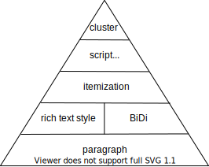
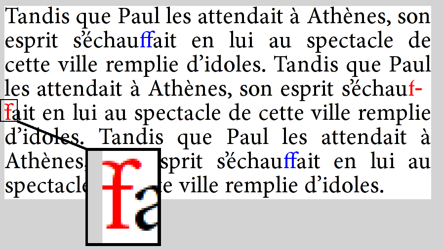

import Copyright, {Declaration} from '@site/src/components/Copyright/TranslationBlogByFlytreeleft';
import {Translation, Text} from '@site/src/components/Translation';

# Text layout is a loose hierarchy of segmentation

<Declaration />

<Translation><Text source lang='en'>

I love text layout, and have been working with it in one form or other for over 35 years.
Yet, knowledge about it is quite arcane.
I don’t believe there is a single place where it’s all properly written down.
I have some explanation for that:
while basic text layout is very important for UI, games, and other contexts,
a lot of the “professional” needs around text layout
are embedded in _much_ more complicated systems
such as Microsoft Word or a modern Web browser.

</Text><Text lang='zh'>

我喜欢文本布局，并且已经以不同形式和它打了35年交道。
然而，有关它的知识还是相当晦涩。
我不认为在某一个地方就能够详尽地阐述它，因为：
虽然基本的文本布局对UI、游戏和其他语境非常重要，
但在如微软 Word 和现代 Web 浏览器这些**更**复杂的系统中，
掌握文本布局是有许多「专业性」要求的。

</Text></Translation>

<Translation><Text source lang='en'>

A complete account of text layout would be at least a small book.
Since there’s no way I can write that now,
this blog post is a small step towards that – in particular,
an attempt to describe the “big picture”
using the conceptual framework of a “loose hierarchy”.
Essentially, a text layout engine breaks the input into finer and finer grains,
then reassembles the results into a text layout object suitable
for drawing, measurement, and hit testing.

</Text><Text lang='zh'>

要完整地讲清楚文本布局，至少得写满一小本书。
由于现在我也没办法写这本书，这篇博客文章就算是迈出的一小步，
特别是，以「松散的层级结构」这一概念框架来描述「大图景」的一种尝试。
本质上，文本布局引擎是将输入拆分成很细很细的小块，
再重新组装为一个适用于绘制、测量和命中测试的文本布局对象。

> 译注：有关「命中测试」的概念，
> 请参考[Hit-Testing in iOS](https://www.jianshu.com/p/64588525ddb9)
> （原文地址[https://smnh.me/hit-testing-in-ios](https://smnh.me/hit-testing-in-ios)）。

</Text></Translation>

<Translation><Text source lang='en'>

The main hierarchy is concerned with laying out the entire paragraph as a single line of text.
Line breaking is also important, but has a separate, parallel hierarchy.

</Text><Text lang='zh'>

主要层级结构关注的是将整个段落布局为一行文本。
换行也同样重要，但具有独立的、平行的层级结构。

</Text></Translation>

<!-- more -->

<Translation titled><Text source lang='en'>

## The main text layout hierarchy

</Text><Text lang='zh'>

## 主要文本布局层级结构

</Text></Translation>

<Translation><Text source lang='en'>

The hierarchy is: paragraph segmentation as the coarsest granularity,
followed by rich text style and BiDi analysis, then itemization (coverage by font),
then Unicode script, and shaping clusters as the finest.

</Text><Text lang='zh'>

该层级结构为：
段落分割做为金字塔底，接着是富文本样式和BiDi分析，
然后是条目化（字体覆盖率），其次是Unicode脚本，塔尖是定形簇。

</Text></Translation>

<Translation titled><Text source lang='en'>

### Paragraph segmentation

</Text><Text lang='zh'>

### 段落分割

</Text></Translation>

<Translation><Text source lang='en'>

The coarsest, and also simplest, segmentation task is paragraph segmentation.
Most of the time, paragraphs are simply separated by newline (U+000A) characters,
though Unicode in its infinite wisdom specifies a number of code point sequences
that function as paragraph separators in plain text:

</Text><Text lang='zh'>

最粗糙，也是最简单的分割任务就是段落分割。
尽管，Unicode以其无限的智慧指定了许多码位作为纯文本中的段落分隔符，
但大多数时候，段落仅需简单地用换行字符（`U+000A`）分隔即可。

</Text></Translation>

- U+000A LINE FEED
- U+000B VERTICAL TAB
- U+000C FORM FEED
- U+000D CARRIAGE RETURN
- U+000D U+000A (CR + LF)
- U+0085 NEXT LINE
- U+2008 LINE SEPARATOR
- U+2009 PARAGRAPH SEPARATOR

<Translation><Text source lang='en'>

In rich text, paragraphs are usually indicated through markup
rather than special characters,
for example `
` or ` ` in HTML.
But in this post, as in most text layout APIs,
we’ll treat rich text as plain text + attribute spans.

</Text><Text lang='zh'>

在富文本中，段落通常由标记符表示，而不是特殊字符，例如HTML中的`
`或` `。
但是在本文中，和大多数文本布局API一样，我们将**富文本**视为**纯文本+属性跨度**。

</Text></Translation>

<Translation titled><Text source lang='en'>

### Rich text style

</Text><Text lang='zh'>

### 富文本样式

</Text></Translation>

<Translation><Text source lang='en'>

A paragraph of rich text may contain _spans_ that can affect formatting.
In particular, choice of font, font weight, italic or no,
and a number of other attributes can affect text layout.
Thus, each paragraph is typically broken into a some number of _style runs_,
so that within a run the style is consistent.

</Text><Text lang='zh'>

富文本段落可能包含影响格式的_跨度_。
特别是字体的选择，字体粗细，斜体或非斜体，
以及其他一些属性也会影响文本布局。
因此，每个段落通常被分成若干个样式运行，
这样，在一个运行中样式是一致的。

</Text></Translation>

<Translation><Text source lang='en'>

Note that some style changes don’t _necessarily_ affect text layout.
A classic example is color. Firefox, rather famously,
does not define segmentation boundaries here for color changes.
If a color boundary cuts a ligature,
it uses fancy graphics techiques to render parts of the ligature in different color.
But this is a subtle refinement and I think not required for basic text rendering.
For more details, see [Text Rendering Hates You](https://gankra.github.io/blah/text-hates-you/).

</Text><Text lang='zh'>

注意，有些样式变化没有_必要_影响文本布局，最好的例子就是颜色。
所周知，Firefox没有为颜色变化定义分割边界。
如果一种颜色处在**连字**的边界上，
它使用花哨的图形技术通过不同颜色来渲染**连字**的各个部分。
但这是一个不易察觉的改进，我认为对于基础的文本渲染是没有必要的。
可以阅读[Text Rendering Hates You](https://gankra.github.io/blah/text-hates-you/)来了解更多。

</Text></Translation>

<Translation titled><Text source lang='en'>

### Bidirectional analysis

</Text><Text lang='zh'>

### 双向文本分析

</Text></Translation>

<Translation><Text source lang='en'>

Completely separate from the style spans,
a paragraph may in general contain both left-to-right and right-to-left text.
The need for bidirectional (BiDi) text is
certainly one of the things that makes text layout more complicated.

</Text><Text lang='zh'>

完全独立于样式跨度，一个段落通常可以包含从左到右和从右到左的文本。
对双向（BiDi）文本的需求无疑是使文本布局更加复杂的原因之一。

</Text></Translation>

<Translation><Text source lang='en'>

Fortunately, this part of the stack is defined
by a standard ([UAX #9](http://www.unicode.org/reports/tr9/)),
and there are a number of good implementations.
The interested reader is referred to
[Unicode Bidirectional Algorithm basics](https://www.w3.org/International/articles/inline-bidi-markup/uba-basics).
The key takeaway here is
that BiDi analysis is done on the plain text of the entire paragraph,
and the result is a sequence of _level runs_,
where the level of each run defines whether it is LTR or RTL.

</Text><Text lang='zh'>

幸运的是，层级结构中的该部分已经有标准（[UAX #9](http://www.unicode.org/reports/tr9/)）做了定义，
并且有很多很好的实现。感兴趣的读者可以参考
[Unicode Bidirectional Algorithm basics](https://www.w3.org/International/articles/inline-bidi-markup/uba-basics)。
这里的关键结论是，BiDi分析是在整个段落的纯文本上完成的，
分析结果是一系列_级别运行_，其中每个运行的级别定义了它是LTR还是RTL。

</Text></Translation>

<Translation><Text source lang='en'>

The level runs and the style runs are then merged,
so that in subsequent stages
each run is of a consistent style and directionality.
As such, for the purpose of defining the hierarchy,
the result of BiDi analysis could alternatively
be considered an implicit or derived rich text span.

</Text><Text lang='zh'>

然后，级别运行和样式运行被合并，这样在随后的阶段中，每个运行都具有一致的样式和方向。
因此，为了定义层级结构，可以将BiDi分析的结果视为隐式或派生的富文本跨度。

</Text></Translation>

<Translation><Text source lang='en'>

In addition to BiDi, which I consider a basic requirement,
a more sophisticated text layout engine will also
be able to handle vertical
[writing modes](https://developer.mozilla.org/en-US/docs/Web/CSS/writing-mode),
including mixed cases where short strings are horizontal within the vertical primary direction.
Extremely sophisticated layout engines will also
be able to handle ruby text and other ways of annotating the main text flow
with intercalated strings.
See [Requirements for Japanese Text Layout](https://www.w3.org/TR/jlreq/)
for many examples of sophisticated layout requirements;
the scope of this blog post really is
basic text layout of the kind needed in user interfaces.

</Text><Text lang='zh'>

除了我认为是基本需求的BiDi之外，更复杂的文本布局引擎还将能够处理垂直
[书写模式](https://developer.mozilla.org/en-US/docs/Web/CSS/writing-mode)，
包括短字符串在垂直主方向内是水平的混合情况。
极其复杂的布局引擎也将能够处理拼音文本和其他用插入字符串注释主要文本流的方式。
关于许多复杂的布局要求的例子，
请参见[Requirements for Japanese Text Layout](https://www.w3.org/TR/jlreq/)，
这篇文章的范围实际上是用户界面所需的基本文本布局。

</Text></Translation>

<Translation titled><Text source lang='en'>

### Itemization (font coverage)

</Text><Text lang='zh'>

### 条目化（字体覆盖率）

</Text></Translation>

<Translation><Text source lang='en'>

Itemization is the trickiest and least well specified part of the hierarchy.
There is no standard for it, and no common implementation.
Rather, each text layout engine deals with it
in its own special way.

</Text><Text lang='zh'>

条目化是层级结构中最棘手和最不明确的部分。
它没有标准，也没有通用的实现。
相反，每个文本布局引擎都以自己特殊的方式处理它。

</Text></Translation>

<Translation><Text source lang='en'>

Essentially, the result of itemization is to choose a single concrete font for a run,
from a _font collection_.
Generally a font collection consists of a main font
(selected by font name from system fonts, or loaded as a custom asset),
backed by a _fallback stack_, which are usually system fonts,
but thanks to [Noto](https://www.google.com/get/noto/)
it is possible to bundle a fallback font stack with an application,
if you don’t mind spending a few hundred megabytes for the assets.

</Text><Text lang='zh'>

从本质上讲，逐项化的结果是从_字体集合_中为运行选择一种具体的字体。
一般来说，字体集合由一个主字体(通过字体名称从系统字体中选择，或作为自定义资源加载)组成，
由一个_后备栈_作支持，后备栈通常是系统字体。
如果您不介意为这些资源花费几百兆字节，
通过[Noto](https://www.google.com/get/noto/)
便可以将后备字体栈与应用程序捆绑在一起。

</Text></Translation>

<Translation><Text source lang='en'>

Why is it so tricky? A few reasons, which I’ll touch on.

</Text><Text lang='zh'>

为什么会如此复杂？有几个原因，我稍后会涉及到。

</Text></Translation>

<Translation><Text source lang='en'>

First, it’s not so easy to determine whether a font can render a particular string of text.
One reason is [Unicode normalization](https://unicode.org/reports/tr15/).
For example, the string “é” can be encoded as U+00E9 (in NFC encoding)
or as U+0065 U+0301 (in NFD encoding).
Due to the principle of [Unicode equivalence](https://en.wikipedia.org/wiki/Unicode_equivalence),
these should be rendered identically,
but a font may have coverage for only one or the other
in its [Character to Glyph Index Mapping](https://docs.microsoft.com/en-us/typography/opentype/spec/cmap)
(cmap) table. The shaping engine has all the Unicode logic to handle these cases.

</Text><Text lang='zh'>

首先，要确定一种字体是否可以呈现特定的文本字符串并不容易。
原因之一是[Unicode标准化](https://unicode.org/reports/tr15/)。
例如，字符串“é”可以被编码为`U+00E9`（NFC编码）或`U+0065 U+0301`（NFD编码）。
由于[Unicode等价原则](https://en.wikipedia.org/wiki/Unicode_equivalence)，
这些字符应该完全相同地呈现，
但是在[字符到字形索引映射](https://docs.microsoft.com/en-us/typography/opentype/spec/cmap)（cmap）表中，
一种字体可能只覆盖其中一种。
定形引擎具有处理这些情况的所有Unicode逻辑。

</Text></Translation>

<Translation><Text source lang='en'>

Of course, realistic fonts with Latin coverage
will have both of these particular sequences covered in the cmap table,
but edge cases certainly do happen, both in extended Latin ranges,
and other scripts such as Hangul, which has complex normalization rules
(thanks in part to a Korean standard for normalization which is somewhat at odds with Unicode).
It’s worth noting that
[DirectWrite gets Hangul normalization quite wrong](https://devblogs.microsoft.com/oldnewthing/20201009-00/?p=104351).

</Text><Text lang='zh'>

当然，覆盖拉丁文的现实字体将在cmap表中覆盖这两个特定序列，
但极端情况肯定会发生，无论是在扩展的拉丁文中，还是在其他脚本中，
比如韩文，都有复杂的规范化规则（部分原因是韩国的规范化标准与Unicode有点不一致）。
值得注意的是，
[DirectWrite对韩文规范化的处理是完全错误的](https://devblogs.microsoft.com/oldnewthing/20201009-00/?p=104351)。

</Text></Translation>

<Translation><Text source lang='en'>

I believe a similar situation exists with the Arabic presentation forms;
see [Developing Arabic fonts](https://www.arabeyes.org/Developing_Arabic_fonts) for more detail on that.

</Text><Text lang='zh'>

</Text></Translation>

<Translation><Text source lang='en'>

Because of these tricky normalization and presentation issues,
the most robust way to determine whether a font can render a string is to try it.
This is how LibreOffice has worked for a while,
and in 2015 [Chromium followed](https://lists.freedesktop.org/archives/harfbuzz/2015-October/005168.html).
See also [Eliminating Simple Text](https://www.chromium.org/teams/layout-team/eliminating-simple-text)
for more background on the Chromium text layout changes.

</Text><Text lang='zh'>

</Text></Translation>

<Translation><Text source lang='en'>

_Another_ whole class of complexity is emoji.
A lot of emoji can be rendered
with either [text or emoji presentation](https://en.wikipedia.org/wiki/Emoji#Emoji_versus_text_presentation),
and there are no hard and fast rules to pick one or the other.
Generally the text presentation is in a symbol font, and the emoji presentation is in a separate color font.
A particularly tough example is the smiling emoji,
which began its encoding life as 0x01 in [Code page 437](https://en.wikipedia.org/wiki/Code_page_437),
the standard 8-bit character encoding of the original IBM PC, and is now U+263A in Unicode.
However, the suggested default presentation is text, which won’t do in a world which expects color.
Apple on iOS unilaterally chose an emoji presentation, so many text stacks follow Apple’s lead.
(Incidentally, the most robust way to encode such emoji
is to append a [variation selector](https://en.wikipedia.org/wiki/Variation_Selectors_(Unicode_block))
to pin down the presentation.)

</Text><Text lang='zh'>

</Text></Translation>

<Translation><Text source lang='en'>

Another source of complexity when trying to write a cross-platform text layout engine
is querying the system fonts.
See [Font fallback deep dive](https://raphlinus.github.io/rust/skribo/text/2019/04/04/font-fallback.html)
for more information about that.

</Text><Text lang='zh'>

</Text></Translation>

<Translation><Text source lang='en'>

I should note one thing, which might help people doing archaeology of legacy text stacks:
it used to be pretty common for text layout to resolve “compatibility” forms such as NFKC and NFKD,
and this can lead to various problems.
But today it is more common to solve that particular problem
by providing a font stack with _massive_ Unicode coverage,
including all the code points in the relevant compatibility ranges.

</Text><Text lang='zh'>

</Text></Translation>

<Translation titled><Text source lang='en'>

### Script

</Text><Text lang='zh'>

### 脚本

</Text></Translation>

<Translation><Text source lang='en'>

The _shaping_ of text,
or the transformation of a sequence of code points into a sequence of positioned glyphs,
depends on the script.
Some scripts, such as Arabic and Devanagari, have extremely elaborate shaping rules,
while others, such as Chinese, are a fairly straightforward mapping from code point into glyph.
Latin is somewhere in the middle, starting with a straightforward mapping,
but ligatures and kerning are also required for high quality text layout.

</Text><Text lang='zh'>

</Text></Translation>

<Translation><Text source lang='en'>

Determining script runs is reasonably straightforward -
many characters have a Unicode script property
which uniquely identifies which script they belong to.
However, some characters, such as space, are “common”,
so the assigned script just continues the previous run.

</Text><Text lang='zh'>

</Text></Translation>

<Translation><Text source lang='en'>

A simple example is “hello мир”.
This string is broken into two script runs: “hello “ is `Latn`, and “мир” is `Cyrl`.

</Text><Text lang='zh'>

</Text></Translation>

<Translation titled><Text source lang='en'>

## Shaping (cluster)

</Text><Text lang='zh'>

## 绘制（文本集）

</Text></Translation>

<Translation><Text source lang='en'>

At this point, we have a run of constant style, font, direction, and script.
It is ready for _shaping_.
Shaping is a complicated process
that converts a string (sequence of Unicode code points) into positioned glyphs.
For the purpose of this blog post, we can generally treat it as a black box.
Fortunately, a very high quality open source implementation exists, in the form of HarfBuzz.

</Text><Text lang='zh'>

</Text></Translation>

<Translation><Text source lang='en'>

We’re not _quite_ done with segmentation, though,
as shaping assigns substrings in the input
to [clusters](https://harfbuzz.github.io/clusters.html) of glyphs.
The correspondence depends a lot on the font.
In Latin, the string “fi” is often shaped to a single glyph (a ligature).
For complex scripts such as Devanagari, a cluster is most often a syllable in the source text,
and complex reordering can happen within the cluster.

</Text><Text lang='zh'>

</Text></Translation>

<Translation><Text source lang='en'>

Clusters are important for _hit testing_,
or determining the correspondence between a physical cursor position in the text layout
and the offset within the text.
Generally, they can be ignored if the text will only be rendered, not edited (or selected).

</Text><Text lang='zh'>

</Text></Translation>

<Translation><Text source lang='en'>

Note that these shaping clusters are distinct from grapheme clusters.
The “fi” example has two grapheme clusters but a single shaping cluster,
so a grapheme cluster boundary can cut a shaping cluster.
Since it’s possible to move the cursor between the “f” and “i”,
one tricky problem is to determine the cursor location in that case.
Fonts _do_ have a [caret table](https://docs.microsoft.com/en-us/typography/opentype/spec/gdef#ligature-caret-list-table),
but implementation is spotty.
A more robust solution is to portion the width of the cluster equally to each grapheme cluster within the cluster.
See also [Let’s Stop Ascribing Meaning to Code Points](https://manishearth.github.io/blog/2017/01/14/stop-ascribing-meaning-to-unicode-code-points/)
for a detailed dive into grapheme clusters.

</Text><Text lang='zh'>

</Text></Translation>

<Translation titled><Text source lang='en'>

## Line breaking

</Text><Text lang='zh'>

## 换行

</Text></Translation>

<Translation><Text source lang='en'>

While short strings can be considered a single strip,
longer strings require breaking into lines.
Doing this properly is quite a tricky problem.
In this post, we treat it as a separate (small) hierarchy,
parallel to the main text layout hierarchy above.

</Text><Text lang='zh'>

</Text></Translation>

<Translation><Text source lang='en'>

The problem can be factored into identifying line break _candidates_,
then choosing a subset of those candidates as line breaks that satisfy the layout constraints.
The main constraint is that lines should fit within the specified maximum width.
It’s common to use a greedy algorithm,
but high end typography tends to use an algorithm that minimizes a raggedness score for the paragraph.
Knuth and Plass have a famous paper,
[Breaking Paragraphs into Lines](http://www.eprg.org/G53DOC/pdfs/knuth-plass-breaking.pdf),
that describes the algorithm used in TeX in detail.
But we’ll focus on the problems of determining candidates and measuring the widths,
as these are tricky enough.

</Text><Text lang='zh'>

</Text></Translation>

<Translation><Text source lang='en'>

In theory, the Unicode Line Breaking Algorithm ([UAX #14](https://unicode.org/reports/tr14/))
identifies positions in a string that are candidate line breaks.
In practice, there are some additional subtleties.
For one, some languages (Thai is the most common) don’t use spaces to divide words,
so need some kind of natural language processing (based on a dictionary) to identify word boundaries.
For two, automatic [hyphenation](https://en.wikipedia.org/wiki/Hyphenation_algorithm) is often desirable,
as it fills lines more efficiently and makes the right edge less ragged.
Liang’s algorithm is most common for automatically inferring “soft hyphens”,
and there are many good implementations of it.

</Text><Text lang='zh'>

</Text></Translation>

<Translation><Text source lang='en'>

Android’s line breaking implementation
(in the [Minikin](https://android.googlesource.com/platform/frameworks/minikin/+/refs/heads/master/libs/minikin) library)
applies an additional refinement:
since email addresses and URLs are common in strings displayed on mobile devices,
and since the UAX #14 rules give poor choices for those,
it has an additional parser to detect those cases and apply different rules.

</Text><Text lang='zh'>

</Text></Translation>

<Translation><Text source lang='en'>

Finally, if words are very long or the maximum width is very narrow,
it’s possible for a word to exceed that width.
In some cases, the line can be “overfull”,
but it’s more common to break the word at the last grapheme cluster boundary
that still fits inside the line.
In Android, these are known as “desperate breaks”.

</Text><Text lang='zh'>

</Text></Translation>

<Translation><Text source lang='en'>

So, to recap, after the paragraph segmentation (also known as “hard breaks”),
there is a loose hierarchy of 3 line break candidates:
word breaks as determined by UAX #14 (with possible “tailoring”), soft hyphens,
and finally grapheme cluster boundaries.
The first is preferred, but the other two may be used in order to satisfy the layout constraints.

</Text><Text lang='zh'>

</Text></Translation>

<Translation><Text source lang='en'>

This leaves another problem, which is suprisingly tricky to get fully right:
how to measure the width of a line between two candidate breaks,
in order to validate that it fits within the maximum width
(or, in the more general case, to help compute a global raggedness score).
For Latin text in a normal font, this seems almost ridiculously easy:
just measure the width of each word, and add them up.
But in the general case, things are nowhere nearly so simple.

</Text><Text lang='zh'>

</Text></Translation>

<Translation><Text source lang='en'>

First, while in Latin, most line break candidates are at space characters,
in the fully general case they can cut anywhere in the text layout hierarchy,
even in the middle of a cluster.
An additional complication is that hyphenation can add a hyphen character.

</Text><Text lang='zh'>

</Text></Translation>

<Translation><Text source lang='en'>

Even without hyphenation,
because [shaping is Turing Complete](https://litherum.blogspot.com/2019/03/addition-font.html),
the width of a line (a substring between two line break candidates) can be any function.
Of course, such extreme cases are rare;
it’s most common for the widths to be exactly equal to the sum of the widths of the words,
and even in the other cases this tends to be a good approximation.

</Text><Text lang='zh'>

</Text></Translation>

<Translation><Text source lang='en'>

So getting this exactly right in the general case is conceptually not difficult,
but is horribly inefficient: for each candidate for the end of the line,
perform text layout (mostly shaping) on the substring from the beginning of the line (possibly inserting a hyphen),
and measure the width of that layout.

</Text><Text lang='zh'>

</Text></Translation>

<Translation><Text source lang='en'>

Very few text layout engines even try to handle this general case,
using various heuristics and approximations which work well most of the time,
but break down when presented with a font with shaping rules that change widths aggressively.
DirectWrite does, however, using very clever techniques that took several years of iteration.
The full story
is in [harfbuzz/harfbuzz#1463 (comment)](https://github.com/harfbuzz/harfbuzz/issues/1463#issuecomment-505592189).
Further analysis, towards a goal of getting this implemented in an open source text layout engine,
is in [yeslogic/allsorts#29](https://github.com/yeslogic/allsorts/issues/29).
If and when either HarfBuzz or Allsorts implements the lower-level logic,
I’ll probably want to write another blog post explaining in more detail
how a higher level text layout engine can take advantage of it.

</Text><Text lang='zh'>

</Text></Translation>

<Translation><Text source lang='en'>

A great example of how line breaking can go wrong
is [Firefox bug 479829](https://bugzilla.mozilla.org/show_bug.cgi?id=479829),
in which an “f + soft hyphen + f” sequence in the text is shaped as the “ff” ligature,
then the line is broken at the soft hyphen.
Because Firefox reuses the existing shaping rather than reshaping the line,
it actually renders with the ligature glyph split across lines:

</Text><Text lang='zh'>

</Text></Translation>

<Translation titled><Text source lang='en'>

## Implementations to study

</Text><Text lang='zh'>

## 实现方案

</Text></Translation>

<Translation><Text source lang='en'>

While I still feel a need for a solid, high-level, cross-platform text layout engine,
there are good implementations to study.
In open source, on of my favorites (though I am biased), is the Android text stack,
based on [Minikin](https://android.googlesource.com/platform/frameworks/minikin/+/refs/heads/master/libs/minikin)
for its lower levels. It is fairly capable and efficient,
and also makes a concerted effort to get “all of Unicode” right,
including emoji. It is also reasonably simple and the code is accessible.

</Text><Text lang='zh'>

</Text></Translation>

<Translation><Text source lang='en'>

While not open source,
[DirectWrite](https://docs.microsoft.com/en-us/windows/win32/directwrite/direct-write-portal)
is also well worth study, as it is without question one of the most capable engines,
supporting Word and the previous iteration of Edge before it was abandonded in favor of Chromium.
Note that there is a [proposal](https://github.com/microsoft/ProjectReunion/issues/112)
for a cross-platform implementation and also potentially to take it open-source.
If that were to happen, it would be something of a game changer.

</Text><Text lang='zh'>

</Text></Translation>

<Translation><Text source lang='en'>

Chromium and Firefox are a rich source as well,
especially as they’ve driven a lot of the improvements in HarfBuzz.
However, their text layout stacks are quite complex and do not have a clean,
documented API boundary with the rest of the application,
so they are not as suitable for study as the others I’ve chosen here.

</Text><Text lang='zh'>

</Text></Translation>

<Translation titled><Text source lang='en'>

### Android

</Text><Text lang='zh'>

### Android

</Text></Translation>

<Translation><Text source lang='en'>

Paragraph and style segmentation (with BiDi) is done at higher levels,
in [Layout.java](https://android.googlesource.com/platform/frameworks/base/+/master/core/java/android/text/Layout.java)
and [StaticLayout.java](https://android.googlesource.com/platform/frameworks/base/+/master/core/java/android/text/StaticLayout.java).
At that point, runs are handed
to [Minikin](https://android.googlesource.com/platform/frameworks/minikin/+/refs/heads/master/libs/minikin)
for lower-level processing.
Most of the rest of the hierarchy is in Layout.cpp, and ultimately shaping is done by HarfBuzz.

</Text><Text lang='zh'>

</Text></Translation>

<Translation><Text source lang='en'>

Minikin also contains a sophisticated line breaking implementation, including Knuth-Plass style optimized breaking.

</Text><Text lang='zh'>

</Text></Translation>

<Translation><Text source lang='en'>

Android deals with shaping boundaries by using heuristics to further segment the text to implied word boundaries
(which are also used as the grain for layout cache).
If a font does shaping across these boundaries, the shaping context is simply lost.
This is a reasonable compromise, especially in mobile, as results are always consistent,
ie the width for measurement never mismatches the width for layout.
And none of the fonts in the system stack have exotic behavior such as shaping across spaces.

</Text><Text lang='zh'>

</Text></Translation>

<Translation><Text source lang='en'>

Android does base its itemization on cmap coverage,
and builds sophisticated bitmap structures for fast queries.
As such, it can get normalization issues wrong, but overall this seems like a reasonable compromise.
In particular, most of the time you’ll run into normalization issues
is with Latin and the combining diacritical marks,
both of which are supplied by Roboto, which in turn has massive Unicode coverage
(and thus less need to rely on normalization logic).
But with custom fonts, handling may be less than ideal,
resulting in more fallback to Roboto than might actually be needed.

</Text><Text lang='zh'>

</Text></Translation>

<Translation><Text source lang='en'>

Note that Minikin was also the starting point for [libTxt](https://github.com/flutter/flutter/issues/11092),
the text layout library used in Flutter.

</Text><Text lang='zh'>

</Text></Translation>

<Translation titled><Text source lang='en'>

### DirectWrite

</Text><Text lang='zh'>

### DirectWrite

</Text></Translation>

<Translation><Text source lang='en'>

Some notes on things I’ve found while studying the API;
these observations are quite a bit in the weeds,
but might be useful to people wanting to deeply understand or engage the API.

</Text><Text lang='zh'>

</Text></Translation>

<Translation><Text source lang='en'>

Hit testing in DirectWrite is based on leading/trailing positions,
while in Android it’s based on primary and secondary.
The latter is more useful for text edition, but leading/trailing is a more well-defined concept
(for one, it doesn’t rely on paragraph direction).
For more information on this topic,
see [linebender/piet#323](https://github.com/linebender/piet/issues/323).
My take is that proper hit testing requires iterating through the text layout
to access lower level structures.

</Text><Text lang='zh'>

</Text></Translation>

<Translation><Text source lang='en'>

While Core Text (see below) exposes a hierarchy of objects,
DirectWrite uses the [TextLayout](https://docs.microsoft.com/en-us/windows/win32/api/dwrite/nn-dwrite-idwritetextlayout)
as the primary interface,
and exposes internal structure (even including lines) by iterating over a callback per run in the confusingly
named [Draw](https://docs.microsoft.com/en-us/windows/win32/api/dwrite/nf-dwrite-idwritetextlayout-draw) method.
The granularity of this callback
is a [glyph run](https://docs.microsoft.com/en-us/windows/win32/api/dwrite/ns-dwrite-dwrite_glyph_run),
which corresponds to “script” in the hierarchy above.
Cluster information is provided in an associated
[glyph run description](https://docs.microsoft.com/en-us/windows/win32/api/dwrite/ns-dwrite-dwrite_glyph_run_description)
structure.

</Text><Text lang='zh'>

</Text></Translation>

<Translation><Text source lang='en'>

There are other ways to access lower level text layout capabilities,
including [TextAnalyzer](https://docs.microsoft.com/en-us/windows/win32/api/dwrite/nn-dwrite-idwritetextanalyzer),
which computes BiDi and line break opportunities, script runs, and shaping.
In fact, the various methods on that interface represents much of the internal structure of the text layout engine.
Itemization, however,
is done in the [FontFallback](https://docs.microsoft.com/en-us/windows/win32/api/dwrite_2/nn-dwrite_2-idwritefontfallback)
interface, which was added later.

</Text><Text lang='zh'>

</Text></Translation>

<Translation titled><Text source lang='en'>

### Core Text

</Text><Text lang='zh'>

### Core Text

</Text></Translation>

<Translation><Text source lang='en'>

Another high quality implementation is [Core Text](https://developer.apple.com/documentation/coretext).
I don’t personally find it as well designed as DirectWrite, but it does get the job done.
In general, though, Core Text is considered a lower level interface,
and applications are recommended to use a higher level mechanism (Cocoa text on macOS, Text Kit on iOS).

</Text><Text lang='zh'>

</Text></Translation>

<Translation><Text source lang='en'>

When doing text layout on macOS, it’s probably better to use the platform-provided itemization method
([CTFontCreateForString](https://developer.apple.com/documentation/coretext/1509506-ctfontcreateforstring)),
rather than getting the font list and doing itemization in the client.
See [linebender/skribo#14](https://github.com/linebender/skribo/issues/14)
for more information on this tradeoff.

</Text><Text lang='zh'>

</Text></Translation>

<Translation titled><Text source lang='en'>

### Druid/Piet

</Text><Text lang='zh'>

### Druid/Piet

</Text></Translation>

<Translation><Text source lang='en'>

At this point, the Druid GUI toolkit does not have its own native text layout engine,
but rather _does_ provide a [cross-platform API](https://www.cmyr.net/blog/piet-text-work.html)
which is delegated to platform text layout engines, DirectWrite and Core Text in particular.

</Text><Text lang='zh'>

</Text></Translation>

<Translation><Text source lang='en'>

The situation on Linux is currently unsatisfactory, as it’s based on the Cairo toy text API.
There is work ongoing to improve this, but no promises when.

</Text><Text lang='zh'>

</Text></Translation>

<Translation><Text source lang='en'>

While the Piet text API is currently fairly basic,
I do think it’s a good starting point for text layout, especially in the Rust community.
While the complexity of Web text basically forces browsers to do all their text layout from scratch,
for UI text there are serious advantages to using the platform text layout capabilities,
including more consistency with native UI, and less code to compile and ship.

</Text><Text lang='zh'>

</Text></Translation>

<Translation titled><Text source lang='en'>

### Pango

</Text><Text lang='zh'>

### Pango

</Text></Translation>

<Translation><Text source lang='en'>

I should at least mention [Pango](https://developer.gnome.org/pango/unstable/),
which provides text layout capabilities for Gtk and other software.
It is open source and has a long history,
but is more focused on the needs of Linux and in my opinion is less suitable as a cross-platform engine,
though there is porting work for both Windows and macOS.
As evidence it hasn’t been keeping quite up to date,
the Windows integration is all based on GDI+ rather than the more recent Direct2D and DirectWrite,
so capabilities are quite limited by modern standards.

</Text><Text lang='zh'>

</Text></Translation>

<Translation titled><Text source lang='en'>

## The question of level

</Text><Text lang='zh'>

## 关于接口层次的问题

</Text></Translation>

<Translation><Text source lang='en'>

A consistent theme in the design of text level APIs is:
what level? Ideally the text layout engine provides a high level API,
meaning that rich text (in some concrete representation) comes in,
along with the fonts, and a text layout object comes out.
However, this is not always adequate.

</Text><Text lang='zh'>

</Text></Translation>

<Translation><Text source lang='en'>

In particular, word processors and web browsers have vastly more complex layout requirements
than can be expressed in a reasonable “attributed string” representation of rich text. F
or these applications, it makes sense to break apart the task of text layout,
and provide unbundled access to these lower levels.
Often, that corresponds to lower levels in the hierarchy I’ve presented.
A good choice of boundary is style runs (including BiDi),
as it simiplifies the question of rich text representation;
expressing the style of a single run is simpler than a data structure
which can represent all formatting requirements for the rich text.

</Text><Text lang='zh'>

</Text></Translation>

<Translation><Text source lang='en'>

Until more recently, web browsers tended to use platform text capabilities for the lower levels,
but ultimately they needed more control, so for the most part, they do all the layout themselves,
deferring to the platform only when absolutely necessary,
for example to enumerate the system fonts for fallback.

</Text><Text lang='zh'>

</Text></Translation>

<Translation><Text source lang='en'>

The desire to accommodate both UI and browser needs motivated the design
of the [skribo](https://github.com/linebender/skribo) API,
and explains why it only handles single style runs.
Unfortunately, the lack of a complementary high level driver proved to be quite a mistake,
as there was no easy way for applications to use the library.
We will be rethinking some of these decisions in coming months.

</Text><Text lang='zh'>

</Text></Translation>

<Translation titled><Text source lang='en'>

## Other resources

</Text><Text lang='zh'>

## 其他资源

</Text></Translation>

<Translation><Text source lang='en'>

A book in progress on text layout
is [Fonts and Layout for Global Scripts](https://simoncozens.github.io/fonts-and-layout/)
by Simon Cozens.
There is more emphasis on complex script shaping and fonts,
but touches on some of the same concepts as here.

</Text><Text lang='zh'>

</Text></Translation>

<Translation><Text source lang='en'>

Another useful resources
is [Modern text rendering with Linux: Overview](https://mrandri19.github.io/2019/07/24/modern-text-rendering-linux-overview.html),
which has a Linux focus and explains Pango in more detail.
It also links the [SIGGRAPH 2018 - Digital typography](https://www.slideshare.net/NicolasRougier1/siggraph-2018-digital-typography)
slide deck, which is quite informative.

</Text><Text lang='zh'>

</Text></Translation>

<Translation><Text source lang='en'>

Thanks to Chris Morgan for review and examples.

</Text><Text lang='zh'>

</Text></Translation>

<Copyright
  source={{
    url: 'https://raphlinus.github.io/text/2020/10/26/text-layout.html',
    author: { name: 'Raph Levien', email: 'raph.levien@gmail.com' }
  }}
  license='CC BY 4.0'
/>
