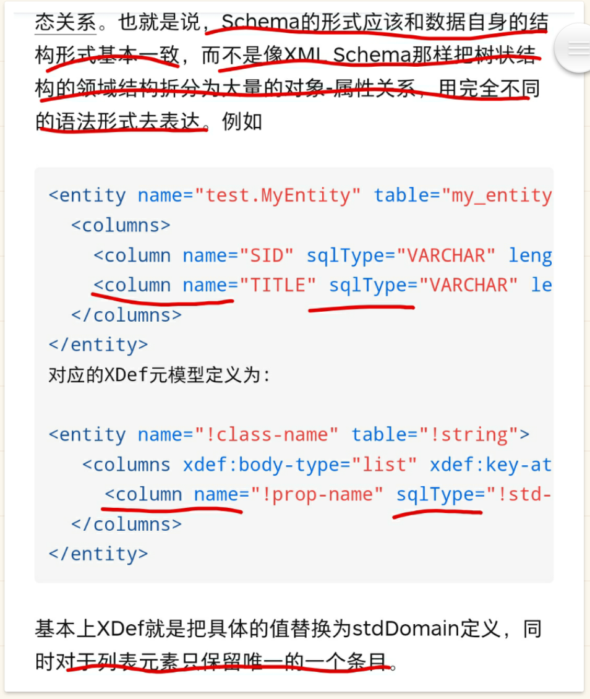

import Header from '@site/docs/pangu-os/\_header.md';

<Header />

- 以「用户数据」为中心设计和构建
- **开发哲学**：一切皆结构化数据；每个函数只做一件事并把它做好；数据间的关联优于一切；函数本质上也是结构化数据（AST 树），通过编译器或解释器翻译为可执行代码；
- **数据结构优先**：先确定数据的结构，再将相同结构的数据归为一类，并为该结构命名。数据录入时以完善结构为主要目标，而不是确定或选择数据类型
- 让知识能够积累下来，为新的开发提供支持，而不是推到知识重来，重复造轮子
- 使用树莓派做实验：外设可控，硬件开源
- 动态视界：一切都是运动的，且可交互的
- 不存在无 bug 的程序，关键是要提供全面且易用的排查机制和工具
- 病毒的能力：修改数据，破坏存储，高消耗 CPU 和内存，窃取数据，恶意传播，控制设备，恶意输出，
- 专注力：视图交互是非必须的，最重要的是，有效数据的直达能力，使用户的注意力完全聚焦于数据，而不是复杂和绚丽的图形界面。想想如何高效地与视力障碍者完成交换？
- 规范都在定义各种形式的表意符号（标记语言中的各种符号），原因是大家都在试图使用（思考模式上也是）无结构的字符串来表达结构化的数据，因为底层设计逻辑都是基于字符串做的表达
- 数据分布式：在多个/种设备间可共享数据，设备间所见数据相同
- 计算分布式：设备间可共享计算，不同设备间交换结构一致的计算结果
- 安全：数据安全为首要，其次是不能做用户未授权的事，不能做用户预期之外的事。数据安全指数据不能损坏、不能丢失、不能窜改、不能窃取、不能泄漏、不能未授权访问、不能未加密传播。
- 函数化：所有应用、库以及操作系统都是函数；运行应用即为调用函数；数据全部结构化，函数间以结构化数据（消息也为结构化数据）通信；函数可并发执行；强制要求发布前提供说明文档以及样例代码；
- 函数调用：`{target: Locale/Remote address, scope: com.xxx.xxx, name: queryXxx, arguments: {...}}`。本地调用不涉及类似跨 Java 虚拟机的问题，都是在一个函数库环境中，所有函数都能访问到，只是执行是隔离的
- 函数版本化：应用共享操作系统提供的函数，且函数均版本化，应用可以使用某个函数的任意版本，系统升级只会产生函数的新版本，而不会对应用所使用的版本产生影响。应用可以自由修改系统函数，但修改仅对应用自身可见，系统会自动为应用创建一个修订分支。对于兼容性和体积的考虑，可以按需下载应用所依赖的函数版本，默认仅提供最新版本的函数即可，另外的方案就是使用容器化机制解决兼容性问题，但容器化也只是在应用隔离层面，向应用提供了其所依赖的函数版本而已
- 商业核心函数：用户只与其服务做数据交换，即，商业核心函数始终运行于企业内部，核心函数对用户数据做处理后，再交给用户客户端处理
- 如何确定一个好的函数名称是很费神的问题，函数也有结构信息，除了代码逻辑语句，还至少包含名称，描述，样例代码，发布版本号，修订版本号，修订历史，源码 HASH 值等信息，所以，可以为每个函数和数据类型生成随机的唯一标识，编写代码时，函数和数据类型都通过标识引用，在执行时再转换为名称引用。名称不是必须的，引用时，可通过说明确定其用途，在需要时可设置一个有明确意义的名称。函数也是对象(树形结构)，相同结构的函数，代码必然相同，名称不会影响执行逻辑。通过对象方式维护函数间调用。函数以 AST 结构存于数据库，执行时直接将该结构传给执行器即可，编辑函数则临时生成可读文本(执行频率高于编辑)。
- 代码段历史：记录来源(复制于何处)，记录每一次修改，修改联动(对相同复制源的修改)，
- 统一的 UI 构建语言与工具，将桌面与 web 的 UI 编程统一（web 实际为远程交互，并不需要特定的浏览器），用户可自由方便地自行设计可用的界面
- 延伸：嵌入式设备为主设备（运行中心系统，分布式）的延伸，用于数据采集和反馈，属于中心系统的一部分
- 统一与一致：数据层面非交互层面
- 软件可在处于任何状态的情况下迁移到其他设备上继续运行
- 避免攻击扩散
- 组成元素：`数据库+处理函数+外设驱动+进程调度`，基础为结构化的数据，核心是函数，数据库为所有数据的存储层，外设为数据的来源
- 结构化数据函数处理系统：`Structed Data and Function Process System - SDFPS`
- 一切皆为数据，不再有文件的概念
- 给数据变更打标签，等同于命名数据(的某个版本)
- 支持记录所有用户操作，所有函数调用。适用于政企机关等要求严格的环境，可随时做审计
- 数据交换时，没有编码和解码过程
- 应用隔离：运行环境独立，数据交换通过接口，读写环境独立，提供应用运行所需的函数版本（兼容性）。隔离的作用是避免某个进程查看或修改其他进程的进程数据，自身稳定性不影响其他进程的稳定性，或者向高权限进程注入不安全代码，从而导致其他进程无法正常运行，以高权限破坏系统和数据，或者敏感数据被泄露。参考 docker 容器机制( https://www.modb.pro/db/143852 )，为函数的运行提供隔离的存储层，对各个设备和各类系统数据的访问需显式授权。
- 应用的作用在于向用户提供直观和便捷的数据操作方式，若去掉应用，应该如何以全新（更便捷更直观更可扩展的）方式操作数据？以文本为例
  - 文本属性：作者，日期，版本等
  - 内容由段落组成
  - 段落由文本+格式组成
  - 每一小段文本都可以指定格式
  - 格式为一个自动生成的引用，该引用指向文本格式的属性集
  - 应用格式 就是对选中文本的 格式属性 赋值为对应 格式的引用
- 只存在一种类型的文档，且可引入图片、表格、视频、外链等媒体元素，默认的文档编辑器具备一定的文档格式化能力，其他文档编辑的应用可在此基础上做其他扩展支持，但其基础的文档结构是不变的，之外的均为扩展属性
- 应用为函数与基础数据的组合，分发的应用会包含二者
- 在最小的 Linux 内核（可考虑 FreeBSD）上搭建该操作系统，内核仅提供启动、网络、设备驱动等的支持（设备驱动和资源调度层），内存和进程管理由该操作系统负责，应用可访问设备和资源通过操作系统的应用权限系统进行控制（应用运行层）
- 可任意跨设备分享单条或多条数据，支持修改与合并
- 存储：存储为结构化不可变数据库，操作系统的函数库及应用数据均存放在数据库中，根据数据空间划分各类数据（进程，设备，应用，函数库等），数据空间数据可放在某个磁盘分区或者一个数据空间一个独立磁盘分区，磁盘分区将格式化为数据库的数据存储格式，一个分区有独立的数据结构和数据元。数据库的性能不受数据量的影响，在服务器端，直接以操作系统的数据库作为应用服务的数据库
- 系统之间交换的均为结构化的数据（包含结构和数据两部分），至于如何展示和操作交换的数据，则由用户选择的应用决定，也就是，某一类数据可根据用户喜好选择不同的应用来展示和处理，从而确保应用生态的繁荣和良性竞争
- 交换的数据，可以设定某些属性为只读，在交换数据回传回源端时，目标端的应用对其的修改将无效
- 跨节点或同节点内的应用的多实例，其单例数据应自动在应用实例间共享
- 可根据资源的使用情况自动优化应用的运行，实现资源的高效利用
- 只管数据的结构，不管数据的类型，函数也按结构处理，以实现相同结构的不同类型的数据能被同一函数处理
- 根据函数所处理的数据结构，自动匹配已存在的函数，供开发者选用
- 监听底层数据库的查询结果更新事件，实时更新系统及应用的已加载数据（系统级别的全局数据缓存，双向同步，应用透明）
- 结构数据有所有者（指应用），一般仅所有者有权限直接修改该数据，其他应用只能通过向数据所有者发送消息，以间接修改其他所有者的数据
- 各个硬件设备均配置一个硬件消息监听任务，负责监听硬件消息，并转发至消息中心，再由消息中心，派发硬件消息至前后台任务，硬件控制消息由任务发出，经消息中心转发至对应的硬件监听任务，再由监听任务操作硬件
- 数据结构样例：`{type: Text, data: ....}`, `{type: Image, data: ...}`。type 等使用原子类型的变量。交换、处理、组合等都是数据的整个结构，而非数据的某个部分（可以取某部分，但是依然是携带了结构的，其结构可能与原数据相同，也可能是类似）。
- 在内部交换时，数据结构不编码，只有与外部交换数据时才做编解码。编码时，结构与数据分离，结构在最开始做声明，数据部分采用`{属性引用:数值引用}*`或`{属性引用:值长度:值内容(字节)}*`方式编码，引用符号要尽可能的短，且可以处理循环引用。结构中包含值的类型，在数据中无需添加引号等标识
- 模型变更、属性增减等，均需记录变更时间、变更人等信息
- 对象局部更新，如：`UPDATE {a: {b: 123}}`
- 对象属性自由添加，且 name 自动生成，用于程序处理，仅通过属性的 label 作为人可读标识，且支持国际化
- 任意对象均可作为一个整体，再在其上附加其他属性信息，类似对象包装，以构造不同业务层面的对象
- 任意应用内的对象（含文本，图像）均可直接提取，并做业务封装，并可被其他应用使用
- 关联对象都是可跳转切换的，在任意位置均可点击查看任意对象，且不限定跳转层级，但提供快速回退到指定位置的能力
- 数据与应用主动关联：不同类型的数据由不同的应用处理，应用可根据类型主动查找可处理数据，如，指定了定时的数据，可由待办应用处理；图片类型的数据，可由图片浏览器和图片编辑器处理
- 密码复制过程中自动加密，在粘贴至目标时，根据目标的权限，自动解密，确保复制过程中不会泄露密码
- 代码风格统一且固定，代码编辑器自动约束书写，如，关键字之间只能空一格等。Elixir 中`Code.string_to_quoted`用于解析代码，可通过宏覆盖 Elixir 的 kernel 模块函数（容器化），可动态注入代码
- `os.device.display.driver.nvidia`：图形绘制库 Vulkan
- 远程连接桌面时，远端的绘制函数在本地的虚拟屏幕上执行，两端仅交互绘制函数而不是图像（可能视频流会更高效），且仅针对变化。可控制可显示内容，可交互操作权限。
- 存在多人交互的场景下，双方的可见数据是共享的，分布式存储
- 外设的配置信息与其唯一标识（如网卡的 Mac、序列号等）绑定，同类外设的配置可相互复制（仅需修改特异性的配置）
- 流式处理，以支持分批次、并行读写数据，避免一次性加载全量数据
- 重置系统就是从原始数据重新开始新的数据分支；多用户就是多用户数据库，并支持多分支；系统数据只有一个库；
- 失败恢复：远程调用发生操作中断时，能从失败点开始自动恢复
- 回滚回放，针对某条数据或某类数据，也可以是整个系统
- 能够针对不同数据的不同使用场景和使用需求，**自动生成数据的展示和处理的页面或者接口**(与人或程序的交互界面)，并根据交互方的权限控制其可读写的数据范围和数据内容
- 标记语言的**各类标记符号可以视为函数**，标记的内容为处理参数，标记相关的附加属性为函数的配置参数。如此，便可以在不同环境下对标记函数进行重定义，从而实现不同的展示和处理需求
- **数据的本质也是函数**？可以将数据自身视为大函数，其由属性这类小函数组成。属性函数在赋值时用于校验数据是否有效，比如，数据类型是否正确，数据有效范围是否合理，数据是否可为空等。属性函数在取值时根据获取方的权限等返回原数据或脱敏等处理后的数据
- 用户交互：根据场景和数据自动生成展示和数据收集界面。自动生成逻辑不处理布局生成细节，只需要声明
- 实践「把零件倒出来再拼装」的开发模式，如果零件有了，那么就还缺胶水，而
  [可逆计算](https://www.zhihu.com/column/reversible-computation)
  便是这种可以组装零件（DSL）的胶水，应用差量机制可以复用前人的工作，
  并在其基础上创造新的应用
- 设备只是提供计算资源，用户数据是永久的与系统和设备无关的，更换设备不影响数据使用，用户不需要重装系统或做数据迁移和数据恢复。应用也是用户数据
- 应用与外部设备交换数据的通道叫端口（Port）。显示，按键，网络等都是端口通信
- 开发过程中实时展示视图变化情况，确保开发流畅
- 数据有多种表现形式和方式，但代码只需要一套，而不是为各种形式写一堆代码
- 应用是操作系统的功能差量，用于补充和提升系统的能力，但与系统是一个有机的整体，而不是寄宿主关系
- 在业务层面，针对业务模型设计 DSL(一种类似 ast 的树形结构)，用于对业务模型及其结构进行差量维护，并用于生成执行代码以及相关的设计工具和用户交互界面: 
- 函数只是一个可以进行运算的结构体，包括暂存变量，计算(通过 CPU 或外设)，暂存或返回运算结果
- 所有信息系统的核心都在于——模型变换
- 「声明式」直接描述最终效果，不关心如何实现。「命令式」关注如何实现，明确怎么一步步达到这个效果。
- 将程序放在一个代码解释虚拟机中执行，再由虚拟机提供用户数据，在虚拟机内，程序看到的就是直接可用的数据，不需要关心数据从哪里来的，也不需要关注存取数据的性能问题，在其可访问到的空间内都是其需要的数据，虚拟机负责从数据库查询程序需要的数据，且仅在需要时才查询。数据的授权控制也在虚拟机中完成
- 系统内的函数根据其所依赖数据的状态变化进行自驱动（由虚拟机决策和调用）
- 程序自声明一些特性就可以通过虚拟机自主根据输入选择并调用合适的程序处理数据
- 与现实类比，程序就像购买的某个物品，具有生产商、外形和用途等特性，在需要取用时，会根据物品的用途和使用范围来确定选用哪一个
- 软件开发应该自上而下进行实现，确定当前层次有哪些块以及各块之间交互的数据和数据结构，再深入到块的内部继续按同样的方式分解该块，需要有工具提供可视化支持。各个块可以视为不同的空间，从外部传递给空间的数据会在转换后成为其数据空间，是一个不同的世界。
- 在函数空间内放置各类函数，编写应用就是编写新的函数用于组织空间内已有的函数以完成特定的处理
- 以消息方式向调试器发送调用链及其上下文
- 可自行按需设计和编写新应用：画一个框便可触发
- 代码函数式，以实现无副作用，支持共享
- 数据没有格式，只有结构，其类型属性只用于被应用识别：按类型组织数据，在类型树下挂实例；类型可自由创建，并添加相关信息
- 统一的数据备份机制
- 根据场景动态生成视图
- 加密二维码，专用解码器（不同供应商有不同的密钥），避免恶意和虚假二维码
- 统一编程语言，支持自定义 DSL，从而适应各种需求
- 应用通过证书加密函数 AST 树，并可设置有效期，从而满足应用的商业化
- 训练 AI 以按照需求自动生成应用 DSL，从而完成生态的快速完善
- 名字只是方便阅读，底层均由 ID 做直接引用（AST 树也如此处理），名字可随时修改，但不影响引用
- UI 只涉及数据展示和接收用户输入，不涉及数据处理，也不涉及数据传输；外观是最不重要的部分，重要的是清晰和便捷
- 应用面向数据，不管数据存储形式和位置，数据读写和存储全部由底层负责

## 参考资料

- [从实现原理看低代码](https://zhuanlan.zhihu.com/p/451340998)
- [2020 前端可视化搭建小报告 - 02 - 链路、架构和难点](https://juejin.cn/post/6905653129803792392)
- [国内低代码平台从业者交流](https://github.com/taowen/awesome-lowcode)
- [「在描述业务的过程中顺带声明依赖，比如你在渲染视图的过程中读取了哪些状态变量，我们就可以认为这个视图依赖了这些状态变量」](https://zhuanlan.zhihu.com/p/101665976)
- [QuickJS Javascript Engine](https://bellard.org/quickjs/quickjs.html)
- [TinyEMU is a system emulator for the RISC-V and x86 architectures. Its purpose is to be small and simple while being complete](https://bellard.org/tinyemu/)
