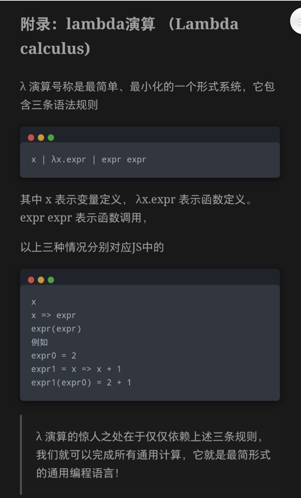

import Header from '@site/docs/pangu-os/\_header.md';

<Header />

- 面向结构编程
- 有限数据集类型
- 最少关键字
- 发布的代码需要私钥签名，确保其不会被恶意修改
  - 开发者在注册时向代码库提供公钥，自行保留私钥
  - 引入的库需要开发者的公钥正确解密后才能用于程序构建
    - 开发时仅需引用函数签名和文档
- 支持可逆计算：分层叠加；坐标定位；
  - 实现可逆的自举，即，用可逆实现语言的扩展性，处处都是坐标
- 以命名空间方式直接引入、赋值和覆盖其他附加结构的数据，不需要提前声明
- 统一采用等号定义变量、类型和函数，类似 Elm。变量的本质就是不带参数的函数
- 匹配分支可包含多个匹配项，不支持任意匹配以避免遗漏
- 引用 Hash 化（内容寻址）: [Unison Lang](https://www.unison-lang.org)
- 编译期可对逻辑代码做差量修改
- 在代码的 AST 树的每个节点设置唯一标识作为定位坐标，用于支持差量定制。开发期引用 AST 树，构建后采用二进制
- 以结构化方式展示和编写代码，彻底消除代码格式不统一和太随意的问题。消除函数名，不再需要定义名称。id 为引用唯一标识，hash 为内容唯一标识
  - 结构化编辑。空格等为非重要内容
  - 结构化编码，非文本行编码
- 最终可执行代码仅包含真正依赖的函数，其依赖库中不相关的函数不参与程序构建
- 以数学符号编写函数?: `f(x, y) = x + y`
- 命名参数的管道支持: `{a: 1, b: 2} | f {c: 3} <=> f {a: 1, b: 2, c: 3}`，即多组命名参数列表将在合并为一组后再传给函数
- 采用中缀表达式编写函数?: `f x y = (+ x y)`
- 数据类型：tuple 类型 `(a,b,c,...)`；union 类型 `type enum = A | B | C，type Tree a = Empty | Node a (Tree a) (Tree a)，type User = Anonymous | Named String`；模式匹配；不可变；
- 文档结构化：代码即文档，文档即代码。参考 [typst](https://github.com/typst/typst)
- 函数化文档系统
  - 相同文本定义为函数，在各处调用函数进行文本引用，确保唯一性
  - 样式和块也是函数，支持统一维护和按需定制
  - 左右布局，左侧为文档编辑，右侧为函数
  - 可随时将相同文本提取为函数，也可自动识别
  - 可导入已有文档，输出任意格式文档。对已有目录内文档做统一管理和源格式生成
- 支持[代数数据类型](https://zhuanlan.zhihu.com/p/788680547)

## 核心特征 {#core-features}

- 函数、类型、全局变量均由其 AST 结构的 HASH 值作为**唯一标识**，可按照任意规范命名，名字长度不受限，
  最终对其的引用均为其唯一标识
  - 函数的参数不管数量多寡，均采用结构体
- 所有库的升级更新均保留已安装版本，确保其他应用依赖的库不发生变化，消除其升级所带来的灾难性影响

## 一切皆树（Everything is Tree） {#everything-is-tree}

- 树是数据和代码的本质结构，其他形式只是面向不同「消费方」的表现形式
- 数据可直接以树结构存取，而代码的编译结果必须是二进制，在其他情况下则可保持其树结构
  - 运行在虚拟机中的编译结果可以是树结构
- 编程语言直接面向树结构进行设计，仅使用少量关键字和符号表示其核心的特征，其余能力以多组「标记」等意义明确的方式标识
  - 符号越多，记忆越困难，所耗费的时间也越多，所编写的代码也会越难维护
- 对代码树，在每个节点上都自动生成唯一的标识，形成代码/函数坐标，从而支持对依赖库进行「差量定制」
  - 依赖库不是二进制形式的，而是树结构（AST），只有运行代码才是二进制形式
  - 如果采用虚拟机形式，则可对依赖库和构建结果均采用树结构
  - 差量可单独使用，采用「只读分层」的组织模式，类似 Docker 的镜像分层机制
  - 在编译期完成差量的「运算」，编译后的形式仅包含最终结果，无多余信息：依赖库也同样是差量运算后的结果
- 需要实现面向树结构的代码编辑器，并围绕「逻辑函数」和「模型结构」进行代码开发和管理

## 代码样例

```elm
{ name="abc"
  style { color=rgb( 0 , 255 , 255 )
  }
}
```



### 属性即类型，类型即函数

```elm
type alias User =
    { name: User.Name
    , gender: User.Gender
    , age: User.Age
    }

type alias User.Name =
    { first: User.Name.First
    , family: User.Name.Family
    }

type alias User.Name.First =
    Capitalize String

type alias User.Name.Family =
    Capitalize String

type User.Gender
    = Male
    | Female

type alias User.Age =
    (Between 1 150) Int

user =
    User
    { name: User.Name
        { first: User.Name.Fisrt '三'
        , family: User.Name.Family '张'
        }
    , gender: User.Gener.Male
    , age: User.Age 28
    }

user.name.first
-- User.Name.Fisrt '三'

user.age
-- User.Age 28

user =
    { user | age = User.Age 200 }

user.age
-- Invalid (User.Age 200) 'User.Age 的有效值只能在 1~150 之间'
```

### 文档即代码，代码即文档

> - 设计参考 [Documenting Unison Code](https://www.unison-lang.org/docs/usage-topics/documentation/)

<!--
```elm
type Block =
  Document (List Block)
  | Section (List Block)
  | Paragraph (List Sentence)
  | Code Code
  | Picture Picture
  | Table Table
  | Graph Graph

type Sentence =
  List Text

type Text =
  Char
  | Blank Int
  | Word (List Char)
```
-->

```elm
{{
  {{{ repeat.signature }}}

  {{{ repeat.signature.name }}} is a function which will repeat the provided text a specified number of times.

  {{{ repeat.doc.examples }}}
}}

repeat.doc.examples : Doc
repeat.doc.examples = {{
  Examples:

  - (repeat 2 "rose is a ") ++ "rose"

  {{{ (repeat 2 "rose is a ") ++ "rose" }}}

  - repeat 0 "zero"

  {{{ repeat 0 "zero" }}}
}}
```

- 文档本质为树形结构的数据（`Doc`），可以被赋值给变量
- `{{ ... }}` 代表文档块，`{{{ ... }}}` 代表代码块，
  并且二者可相互多级嵌套。在文档文件中，默认内容均为文档块，
  而在代码文件中，默认内容均为代码
- 在文档中的代码块内定义的函数和变量可在树的父子层级内可被调用，
  即，其作用域为树的纵向方向，在同级内的后继代码块中也可访问
- 对于富文本内容则通过 `Doc` 中的函数进行处理，且函数一般均返回文档对象节点，
  比如，在文档中插入图片 `{{{ Doc.image './img/doc-as-code.png' }}}`，
  在文档中插入表格 `{{{ Doc.table (Doc.table.header []) (Doc.table.body []) }}}`

## 参考资料

- [Y组合子的一个启发式推导](https://zhuanlan.zhihu.com/p/547191928)
- [如何看待 typst?](https://www.zhihu.com/question/591143170/answer/3304601296)
