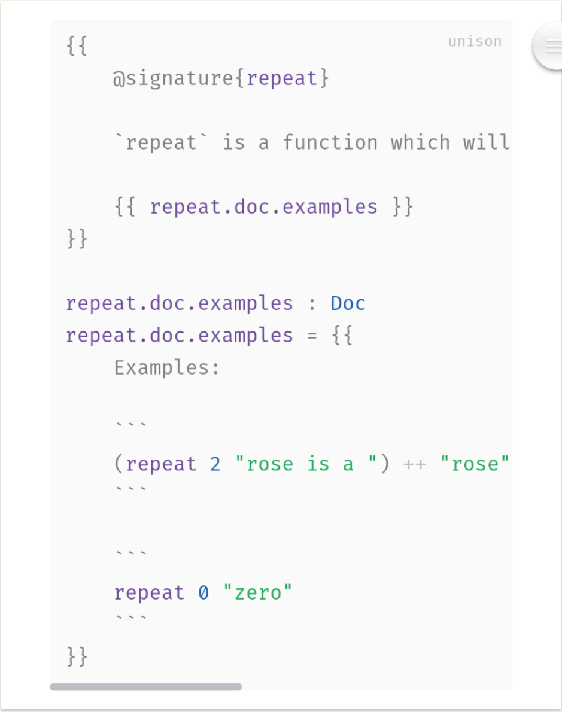

import Header from '../\_header.md';

<Header />

- 结构化编辑。空格等为非重要内容
- 面向结构编程
- 有限数据集类型
- 最少关键字
- 支持可逆计算：分层叠加；坐标定位；
- 以命名空间方式直接引入、赋值和覆盖其他附加结构的数据，不需要提前声明
- 统一采用等号定义变量、类型和函数，类似 Elm。变量的本质就是不带参数的函数
- 匹配分支可包含多个匹配项，不支持任意匹配以避免遗漏
- 引用 Hash 化（内容寻址）: [Unison Lang](https://www.unison-lang.org)
- 编译期可对逻辑代码做差量修改
- 在代码的 AST 树的每个节点设置唯一标识作为定位坐标，用于支持差量定制。开发期引用 AST 树，构建后采用二进制
- 以结构化方式展示和编写代码，彻底消除代码格式不统一和太随意的问题。消除函数名，不再需要定义名称。id 为引用唯一标识，hash 为内容唯一标识
- 以数学符号编写函数?: `f(x, y) = x + y`
- 命名参数的管道支持: `{a: 1, b: 2} | f {c: 3} <=> f {a: 1, b: 2, c: 3}`，即多组命名参数列表将在合并为一组后再传给函数
- 采用中缀表达式编写函数?: `f x y = (+ x y)`
- 数据类型：tuple 类型 `(a,b,c,...)`；union 类型 `type enum = A | B | C，type Tree a = Empty | Node a (Tree a) (Tree a)，type User = Anonymous | Named String`；模式匹配；不可变；
- 文档结构化：代码即文档，文档即代码。参考 [typst](https://github.com/typst/typst)
- 函数化文档系统
  - 相同文本定义为函数，在各处调用函数进行文本引用，确保唯一性
  - 样式和块也是函数，支持统一维护和按需定制
  - 左右布局，左侧为文档编辑，右侧为函数
  - 可随时将相同文本提取为函数，也可自动识别
  - 可导入已有文档，输出任意格式文档。对已有目录内文档做统一管理和源格式生成

## 代码样例

```elm
{ name="abc"
  style { color=rgb( 0 , 255 , 255 )
  }
}
```


### 属性即类型，类型即函数

```elm
type alias User =
    { name: User.Name
    , gender: User.Gender
    , age: User.Age
    }

type alias User.Name =
    { first: User.Name.First
    , family: User.Name.Family
    }

type alias User.Name.First =
    Capitalize String

type alias User.Name.Family =
    Capitalize String

type User.Gender
    = Male
    | Female

type alias User.Age =
    (Between 1 150) Int

user =
    User
    { name: User.Name
        { first: User.Name.Fisrt '三'
        , family: User.Name.Family '张'
        }
    , gender: User.Gener.Male
    , age: User.Age 28
    }

user.name.first
-- User.Name.Fisrt '三'

user.age
-- User.Age 28

user =
    { user | age = User.Age 200 }

user.age
-- Invalid (User.Age 200) 'User.Age 的有效值只能在 1~150 之间'
```

### 函数化文档系统

```elm
type Block =
  Document (List Block)
  | Section (List Block)
  | Paragraph (List Sentence)
  | Code Code
  | Picture Picture
  | Table Table
  | Graph Graph

type Sentence =
  List Text

type Text =
  Char
  | Blank Int
  | Word (List Char)
```

### 文档也是结构化数据，可以被复制给变量



## 参考资料

- [Y组合子的一个启发式推导](https://zhuanlan.zhihu.com/p/547191928)
- [如何看待 typst?](https://www.zhihu.com/question/591143170/answer/3304601296)